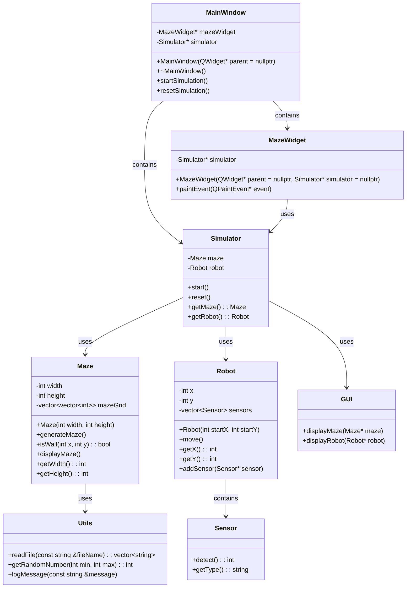

Wstępny Opis Projektu: Symulacja Micromouse

1. Opis Projektu

<!-- TODO
Done:
Logger, Utils, Maze, Simulator

check the teleporting one + main threading

Patterns collaborate class 
GL course
pola zawsze prywatne chyba ze pole jest obiektem ktory sam sie chroni to moze byc protected/public  

Check the documentation
setup doc generation

  -->

Projekt zakłada stworzenie symulacji robota typu micromouse, którego zadaniem jest przejście przez labirynt. Robot będzie wyposażony w czujniki, które pozwolą mu zbierać dane o otoczeniu, i na ich podstawie podejmować decyzje dotyczące ruchu. Symulacja będzie zawierała wizualizację ruchu robota w labiryncie.

2.  Funkcjonalność

    Generowanie i wyświetlanie labiryntu: Labirynt będzie generowany losowo lub wczytywany z pliku. Będzie wyświetlany w interfejsie użytkownika, pokazując zarówno ściany, jak i wolne przestrzenie.
    Symulacja ruchu robota: Robot będzie poruszał się po labiryncie, analizując dane z czujników i podejmując decyzje o kierunku ruchu. Ruch robota będzie wizualizowany na ekranie.
    Czujniki robota: Robot będzie wyposażony w czujniki odległości (na przód, lewo, prawo), które pozwolą mu ocenić odległość do najbliższej ściany w tych kierunkach.
    Algorytm nawigacji: Robot będzie używał prostych algorytmów nawigacji, takich jak śledzenie ściany, aby znaleźć wyjście z labiryntu. Algorytm będzie oparty na lokalnych danych z czujników.
    Interfejs użytkownika: Program będzie posiadał prosty graficzny interfejs użytkownika (GUI), umożliwiający uruchomienie symulacji, pauzowanie, resetowanie oraz modyfikowanie parametrów labiryntu i robota.
    Raportowanie postępów: Program będzie wyświetlał informacje o postępach robota, takie jak liczba kroków, odległość od celu, itp.

3.  Szkic Interfejsu Użytkownika
    3.1. Główne okno aplikacji

        Obszar wyświetlania labiryntu: Centralna część okna, gdzie będzie wyświetlany labirynt i pozycja robota.
        Panel kontrolny: Panel boczny zawierający przyciski sterujące:
        Start/Pauza: Rozpoczęcie lub zatrzymanie symulacji.
        Reset: Zresetowanie symulacji.
        Opcje: Ustawienia parametrów labiryntu i robota.

3.2. Diagram klas

    Micromouse: Klasa reprezentująca robota. Zawiera dane o położeniu, kierunku ruchu, stanach czujników oraz metodach podejmowania decyzji na podstawie lokalnych danych.
    Maze: Klasa reprezentująca labirynt. Zawiera informacje o strukturze labiryntu oraz metodach generowania i wyświetlania labiryntu.
    Simulator: Klasa odpowiedzialna za symulację, zawierająca metody do uruchamiania, pauzowania i resetowania symulacji oraz integrująca klasę Micromouse i Maze.
    GUI: Klasa obsługująca graficzny interfejs użytkownika, odpowiedzialna za rysowanie labiryntu i robota oraz obsługę interakcji użytkownika.

1. Struktura katalogów projektu

        MicromouseProject/
        ├── docs/
        │   └── doxygen_config
        ├── include/
        │   ├── Logger.h
        │   ├── Maze.h
        │   ├── Micromouse.h
        │   ├── Sensor.h
        │   ├── Simulator.h
        │   └── Utils.h
        ├── src/
        │   ├── Logger.cpp
        │   ├── Maze.cpp
        │   ├── Micromouse.cpp
        │   ├── Sensor.cpp
        │   ├── Simulator.cpp
        │   └── Utils.cpp
        ├── tests/
        │   └── test_maze.cpp
        ├── .gitignore
        ├── build.sh
        ├── CMakeLists.txt
        ├── main.cpp
        └── README.md

Dependencies:

<!-- ###### QT5

sudo apt install qt5-default -->

###### Google Test

git clone https://github.com/google/googletest.git
cd googletest
mkdir build
cd build
cmake ..
make
sudo make install

####### Doxygen

sudo apt install doxygen clang llvm

## Opis diagramu:

    Simulator: Zarządza instancjami Maze i Robot, oraz kontroluje symulację.
    Maze: Reprezentuje labirynt, zawiera siatkę z komórkami labiryntu oraz metody do generowania i wyświetlania labiryntu.
    Robot: Reprezentuje robota w labiryncie, przechowuje jego pozycję oraz sensory.
    Sensor: Reprezentuje czujnik robota, wykrywa otoczenie.
    GUI: Odpowiada za wyświetlanie labiryntu i robota, ale w tej strukturze jest to klasa abstrakcyjna, bardziej jak koncept.
    MainWindow: Główne okno aplikacji Qt, zawiera widget labiryntu oraz instancję symulatora.
    MazeWidget: Widget odpowiedzialny za rysowanie labiryntu i robota.
    Utils: Zawiera funkcje pomocnicze, takie jak czytanie plików, generowanie liczb losowych oraz logowanie wiadomości.

Sensor

Sensor Class

The Sensor class serves as a base class for various sensors used in a maze environment. It provides common functionality and data members that are shared among different sensor types.
Constructor and Destructor

    Constructor: Sensor(Maze* maze, const std::string& name)
        Initializes the sensor with a pointer to a Maze object and a name for identification.
        Sets up a unique Logger object specific to the sensor's name for logging purposes.
        Initializes directionNames, a map that associates direction vectors with their corresponding names (e.g., {{-1, 0}, "West"}).
        Enables file output for logging and clears any existing log files.

    Destructor: virtual ~Sensor()
        Ensures proper cleanup by disabling file output for logging when the sensor object is destroyed.

Virtual Function

    Virtual Function: virtual void getSensorData(int x, int y, std::vector<std::vector<int>>& knownMaze, int step) const = 0;
        A pure virtual function that must be implemented by derived sensor classes.
        Retrieves sensor data for a specific coordinate (x, y) in the maze and updates knownMaze, a 2D vector representing the maze's state.
        step parameter indicates the current step or iteration count during data retrieval.

Data Members

    Data Members:
        maze: Pointer to the Maze object that represents the maze environment.
        directionNames: A map that associates direction vectors (std::pair<int, int>) with human-readable direction names (std::string).
        logger: Unique pointer to a Logger object used for logging sensor activities.
        steps: Integer variable that counts the number of steps or iterations.

Summary

The Sensor class encapsulates common functionality and data members needed by various sensor types in a maze navigation or mapping scenario. It manages logging activities, maintains direction mappings, and ensures proper initialization and cleanup of resources. Derived sensor classes extend this base functionality by implementing the getSensorData method according to their specific sensor behavior.

This architecture supports modular and extensible sensor implementations, enabling efficient management and utilization of sensor data within the maze environment.

DistanceSensor Class

The DistanceSensor class represents a sensor used for detecting obstacles (walls) in orthogonal directions (North, South, East, West) from a specific coordinate (x, y) in a maze environment. It inherits from a base class Sensor.
Constructor

    Constructor: DistanceSensor(Maze* maze)
        Initializes the sensor with a pointer to a Maze object, which represents the environment where the sensor operates.

getSensorData Function

The getSensorData function retrieves sensor data for a given coordinate (x, y) in the maze and updates a 2D vector knownMaze to reflect the detection results.
Parameters

    x, y: Coordinates within the maze where the sensor is positioned.
    knownMaze: A 2D vector that maintains the current known state of the maze, where 0 indicates no wall and 1 indicates a wall.
    step: Current step number or iteration count.

Behavior

    Functionality:
        Initializes knownMaze[x][y] to 0, indicating no wall at the starting position (x, y).
        Iterates through predefined directions (North, South, East, West) to scan for walls:
            Calculates coordinates (nx, ny) in each direction relative to (x, y).
            Checks if (nx, ny) is within the bounds of knownMaze.
            If within bounds, checks if there is a wall (maze->isWall(nx, ny)):
                Updates knownMaze and logs a message indicating whether a wall was detected or not.
            If (nx, ny) is out of bounds, logs an appropriate message indicating the boundary breach.

Logging

    Logging:
        Utilizes a logger to log messages indicating:
            Detection of walls (Wall detected) or absence of walls (No wall detected) in each direction (North, South, East, West).
            Out-of-bounds conditions encountered during scanning in each direction.

Summary

The DistanceSensor class provides functionality to scan orthogonal directions from a starting position (x, y) within a maze. It uses a Maze object to query the environment and updates a 2D vector (knownMaze) to maintain a representation of the maze's layout based on sensor readings. The getSensorData function handles scanning for walls, logs detection results, and manages boundary conditions to ensure accurate mapping of the maze environment.

This setup is beneficial for applications requiring obstacle detection and spatial awareness within a maze-like environment, facilitating navigation or mapping tasks effectively.

Logger

Logger Class

The Logger class provides functionality for logging messages to a file and/or the console.
Constructor

    Constructor: Logger(const std::string& filePath)
        Initializes the Logger object with the path to the log file (filePath).
        Calls createLogDirectory to ensure the directory structure exists for the log file.

Public Methods

    logMessage: Logs a message to both the file (if enabled) and the console.
        Parameters:
            message: The message to log.
            includeTimestamp (optional): Indicates whether to include a timestamp in the logged message.
        Returns a reference to the Logger object.
        If logToFile is true, writes the formatted message to the log file (logFile) and optionally to the console.
        If logToFile is false, logs the message only to the console.

    enableFileOutput: Enables logging to a file.
        Parameters:
            toFileOnly (optional): Specifies whether to log exclusively to the file or also to the console.
        Returns a reference to the Logger object.
        Opens the log file (logFilePath) for appending (std::ios::app mode).
        Sets logToFile to true and logToFileOnly based on the provided parameter.
        Displays debug messages (if DEBUG_MODE is defined) about the logging configuration.

    disableFileOutput: Disables logging to the file.
        Returns a reference to the Logger object.
        Closes the log file (logFile) if it is currently open.
        Resets logToFile and logToFileOnly to false.
        Prints debug information (if DEBUG_MODE is defined) confirming the change in logging behavior.

    clearLogFile: Clears the contents of the log file.
        Returns a reference to the Logger object.
        Uses Utils::clearFile to truncate the log file (logFilePath).

Private Methods

    createLogDirectory: Creates the directory structure for the log file if it doesn't exist.
        Extracts the directory path from logFilePath and uses Utils::createDirectory to ensure the directory exists.

Data Members

    logToFile: Indicates if logging to the file is enabled.
    logToFileOnly: Indicates if logging exclusively to the file is enabled.
    logFile: Output file stream used for logging messages to the file.
    logFilePath: Path to the log file.

Summary

The Logger class encapsulates functionality for logging messages with optional timestamps to a specified file path. It supports enabling/disabling file output, clearing the log file, and managing logging behavior between file and console outputs. This setup facilitates organized logging in applications, aiding in debugging, monitoring, and analysis tasks. The class ensures efficient file handling and robust logging capabilities within a program.

Maze Class

The Maze class represents a maze structure and provides various functionalities related to its generation, manipulation, and logging.
Constructor and Singleton Pattern

    Constructor: Maze()
        Private constructor to prevent direct instantiation.
        Initializes width and height of the maze (default: 21x21).
        Initializes mazeGrid as a 2D vector representing the maze, initially filled with walls (1).
        Initializes logger using Logger class to log maze operations to a specified log file (./logs/maze.log).
        Initializes directionNames to map direction offsets ({{-1, 0}, "West"}, {1, 0}, "East"}, {0, -1}, "South"}, {0, 1}, "North"}).

Destructor

    Destructor: ~Maze()
        Cleans up by disabling file output for logging (logger->disableFileOutput()).
        Deletes the singleton instance (instance).

Singleton Instance

    getInstance(): Returns the single instance of Maze.
        Implements the singleton pattern to ensure only one instance of Maze exists.
        If instance doesn't exist, creates a new Maze object.

Public Methods

    Accessors: getWidth(), getHeight()
        Returns the width and height of the maze.

    displayMaze()
        Logs the current state of the maze (mazeGrid) to the logger.
        Formats the maze with walls (#) and spaces for empty spaces.
        Uses logger->logMessage() to display each row of the maze.

    getMazeGrid()
        Returns a constant reference to the maze grid (mazeGrid).

    readExit()
        Returns the coordinates of the maze exit as a pair (exit).

    isWall(int x, int y)
        Checks if the cell at coordinates (x, y) is a wall (1).
        Returns true if the cell is a wall, otherwise false.

    setLogger(const std::string& logFile, bool toFileOnly = true)
        Sets the logger for the maze with a specified log file path (logFile).
        Optionally specifies whether to log only to the file (toFileOnly).
        Uses Logger class methods to configure and enable logging.

Private Methods

    Maze Generation: generateMaze(), carvePassage(int x, int y), createRandomExit()

        generateMaze(): Initiates maze generation process.
            Calls carvePassage(1, 1) to start carving passages from the maze's starting point.
            Calls createRandomExit() to randomly create an exit on the maze's border.

        carvePassage(int x, int y): Recursively carves passages from the given coordinates (x, y).
            Uses a depth-first search approach to carve paths (0) through the maze.
            Logs each step of the carving process using logger->logMessage().

        createRandomExit(): Randomly selects a valid border cell and designates it as the maze exit.
            Uses isValidExit(int x, int y) to verify the selected cell is suitable for an exit.
            Logs the creation of the exit using logger->logMessage().

    Validation: isValidExit(int x, int y)
        Checks if a potential exit at coordinates (x, y) meets the criteria for a valid exit:
            Must be adjacent to open spaces (0) in the maze grid.

    Utility: printMazeWithCurrentCarve(int cx, int cy)
        Logs the current state of the maze with an indication (C) of the current position being carved.

Summary

The Maze class encapsulates maze generation and manipulation logic, providing methods to retrieve maze dimensions, display the maze, access maze grid data, and manage logging of maze operations. It employs the singleton pattern to ensure a single instance exists throughout the program's execution, enhancing consistency and control over maze generation and logging activities. This design facilitates organized development and debugging of maze-related applications.

LaserSensor Class

The LaserSensor class represents a sensor used for detecting walls in multiple directions (North, South, East, West) starting from a specific coordinate (x, y) in a maze environment. It inherits from a base class Sensor.
Constructor

    Constructor: LaserSensor(Maze* maze)
        Initializes the sensor with a pointer to a Maze object, which represents the environment where the sensor operates.

getSensorData Function

The getSensorData function retrieves sensor data for a starting coordinate (x, y) in the maze and updates a 2D vector knownMaze to reflect the detection results.
Parameters

    x, y: Starting coordinates within the maze where the sensor is positioned.
    knownMaze: A 2D vector that maintains the current known state of the maze, where 0 indicates no wall and 1 indicates a wall.
    step: Current step number or iteration count.

Behavior

    Functionality:
        Checks if the starting position (x, y) is within the maze bounds. If not, logs an out-of-bounds message and exits.
        Initializes knownMaze[x][y] to 0, indicating no wall at the starting position.
        Iterates through predefined directions (North, South, East, West) to scan for walls:
            Continues scanning in each direction until a wall (maze->isWall(nextX, nextY) returns true) or an out-of-bounds condition is encountered.
            Updates knownMaze accordingly based on whether a wall is detected or not.
            Logs messages detailing each detection step, including whether a wall was detected or not and the coordinates involved.

Logging

    Logging:
        Utilizes a logger to log messages indicating:
            Detection of walls or open spaces (Laser detected wall or Laser detected no wall) in each direction (North, South, East, West).
            Out-of-bounds conditions encountered during scanning in each direction.

Summary

The LaserSensor class provides functionality to scan multiple directions from a starting position (x, y) within a maze. It uses a Maze object to query the environment and updates a 2D vector (knownMaze) to maintain a representation of the maze's layout based on sensor readings. The getSensorData function handles scanning for walls in orthogonal directions, logs detection results, and manages boundary conditions, ensuring accurate mapping of the maze environment.

This setup is useful for applications involving maze exploration or obstacle detection where a detailed scan of adjacent positions is necessary for navigation or mapping purposes.

LidarSensor Class

The LidarSensor class represents a sensor used for detecting walls and open spaces (no walls) in a maze environment. It inherits from a base class Sensor.
Constructor

    Constructor: LidarSensor(Maze* maze)
        Initializes the sensor with a pointer to a Maze object, which represents the environment where the sensor operates.

getSensorData Function

The getSensorData function retrieves sensor data for a specific coordinate (x, y) in the maze and updates a 2D vector knownMaze to reflect the detection results.
Parameters

    x, y: Coordinates within the maze where the sensor is positioned.
    knownMaze: A 2D vector that maintains the current known state of the maze, where 0 indicates no wall and 1 indicates a wall.
    step: Current step number or iteration count.

Behavior

    Functionality:
        The function iterates over a 5x5 grid (from -2 to 2 for both dx and dy).
        It skips the center (x, y) position (dx = 0, dy = 0).
        For each adjacent position (nx, ny) within the maze boundaries:
            Updates knownMaze based on whether maze->isWall(nx, ny) returns true (wall detected) or false (no wall detected).
            Logs the detection result and direction relative to the current (x, y) position.
        Handles out-of-bounds scenarios by logging these occurrences.

Logging

    Logging:
        Utilizes a logger to log messages indicating:
            Whether a wall or open space is detected.
            The direction relative to the current position (Current position, North, South, East, West, etc.).
            Indicates when a position is out of bounds.

Summary

The LidarSensor class provides functionality to detect walls and open spaces around a specific coordinate in a maze. It uses a Maze object to query the environment and updates a 2D vector (knownMaze) to maintain a representation of the maze's layout based on sensor readings. The getSensorData function handles adjacent positions, logs detection results, and manages boundary conditions, ensuring accurate mapping of the maze environment.

This setup is useful for applications involving maze navigation or mapping where real-time detection of obstacles is crucial for decision-making processes.

Simulator

The Simulator class manages the simulation of a Micromouse navigating through a Maze.
Constructor and Destructor

    Constructor: Simulator(std::shared_ptr<Micromouse> micromouse, Maze* maze)
        Initializes micromouse with a shared pointer to a Micromouse object.
        Initializes maze with a pointer to a Maze object.
        Sets initial values for startX, startY, steps, startTime, totalSeconds, running, and initializes logger.
        Calls setRandomStartPosition() to set a random start position for the micromouse.
        Configures the logger (logger) to output to "logs/simulator.log", clears the log file, and logs initialization.

    Destructor: ~Simulator()
        Cleans up by disabling file output for logging (logger->disableFileOutput()).

Public Methods

    run()
        Starts the simulation loop:
            Sets running to true.
            If startTime is uninitialized, sets it to the current time.
            Loops until running is false or the micromouse reaches the maze exit (hasReachedGoal()):
                Calls micromouse->move() to simulate the micromouse movement.
                Updates steps with the micromouse's step count (micromouse->getStep()).
                Displays the maze with the micromouse's current position (displayMazeWithMouse()).
                Checks for wall collisions (checkAndHandleWallCollision()).
                Pauses for 50 milliseconds using std::this_thread::sleep_for() to control simulation speed.
            Logs completion of the simulation or pause if the micromouse reaches the goal or simulation is paused.

    start()
        Starts or resumes the simulation:
            If running is false, spawns a detached thread to execute run() in parallel.
            Logs that the simulation has started.

    pause()
        Pauses the simulation:
            Sets running to false.
            Logs that the simulation has been paused.

    reset()
        Resets the simulation:
            If running is false, resets steps, startTime, totalSeconds, and the micromouse's position using micromouse->reset() and setRandomStartPosition().
            Logs the reset operation or an error message if the simulation is running.

Private Methods

    setRandomStartPosition()
        Sets a random starting position (startX, startY) for the micromouse within the maze:
            Uses a random number generator (std::random_device, std::mt19937, std::uniform_int_distribution) to select a corner of the maze.
            Updates micromouse's position and logs the micromouse's starting coordinates.

    displayMazeWithMouse()
        Displays the current state of the maze with the micromouse's position:
            Retrieves the micromouse's known maze grid (grid) and current position (mouseX, mouseY).
            Constructs a string representation of each row in the maze, indicating the micromouse's position ('M'), unknown areas ('?'), walls ('#'), and empty spaces (' ').
            Logs each row of the maze and additional simulation details (steps taken, simulation time).

    hasReachedGoal()
        Checks if the micromouse has reached the maze exit:
            Retrieves the exit coordinates from maze using maze->readExit().
            Compares the micromouse's current position (micromouse->getPosX(), micromouse->getPosY()) with the exit coordinates.
            Returns true if the micromouse is at the exit, otherwise false.

    checkAndHandleWallCollision()
        Checks if the micromouse has collided with a wall:
            Retrieves the micromouse's current position (currentX, currentY).
            Uses maze->isWall(currentX, currentY) to check if the cell at (currentX, currentY) is a wall.
            Logs a collision message and terminates the simulation if a collision is detected (exit(0)).

Summary

The Simulator class orchestrates the simulation of a micromouse navigating through a maze. It interfaces with the Micromouse and Maze classes to control the micromouse's movement, manage simulation state, and handle logging of simulation events. This structured approach allows for clear separation of concerns and facilitates effective simulation management and monitoring.

Utils

Utils Namespace

The Utils namespace provides utility functions for various tasks commonly needed in software applications.
Functions

    getRandomNumber(int min, int max)
        Generates a random integer within the specified range [min, max].
        Uses std::random_device and std::mt19937 for random number generation, ensuring randomness.
        Returns the generated random integer.

    getCurrentDateTime()
        Retrieves the current date and time as a formatted string (YYYY-MM-DD HH:MM:SS).
        Uses std::time, std::strftime, and std::localtime to format the current system time.
        Returns the formatted date-time string.

    createDirectory(const std::string& dirPath)
        Creates a directory at the specified dirPath if it does not already exist.
        Uses stat to check if the directory exists.
        Uses mkdir to create the directory with full permissions (0777).
        Prints debug messages (if DEBUG_MODE is defined) confirming directory creation.

    clearFile(const std::string& filePath)
        Clears the contents of the file specified by filePath.
        Opens the file in truncation mode (std::ios::trunc) using std::ofstream.
        Prints debug messages (if DEBUG_MODE is defined) confirming file clearing.

    fileExists(const std::string& filePath)
        Checks if the file specified by filePath exists.
        Opens the file using std::ifstream and prints debug messages (if DEBUG_MODE is defined) indicating file existence.

Header File (Utils.h)

    Header Guard (#ifndef, #define, #endif): Ensures that the header file contents are included only once during compilation to prevent multiple definitions.

Implementation File (Utils.cpp)

    Implementation: Defines all functions declared in Utils.h.
    Includes necessary headers (<random>, <fstream>, <iostream>, <ctime>, <sys/stat.h>) for functionality implementation.

Summary

The Utils namespace encapsulates functions that handle random number generation, date-time formatting, directory creation, file manipulation (clearing and existence checking), and debug output. These utilities facilitate common tasks in software development, enhancing code modularity, reusability, and maintainability. The namespace structure ensures organized access to utility functions across different parts of an application.

main / CommandQueue

CommandQueue Class

The CommandQueue class manages commands input by the user in a thread-safe manner using a queue and synchronization mechanisms.
Member Functions

    push(const std::string& command):
        Pushes a command onto the queue.
        Uses a std::lock_guard to lock the mutex (mtx) for thread safety.
        Notifies the condition variable (cv) to wake up a waiting thread if one exists.

    pop(std::string& command):
        Pops a command from the queue.
        Uses a std::unique_lock to lock the mutex (mtx).
        Waits for up to 100 milliseconds for a command to become available using cv.wait_for.
        If a command is available, retrieves and returns it, otherwise returns false.

Data Members

    commands: std::queue<std::string> to store commands.
    mtx: std::mutex for thread safety.
    cv: std::condition_variable for synchronization.

main Function (Micromouse Simulation Program)

The main function orchestrates the simulation of a Micromouse navigating a maze, with user input handled through CommandQueue.
Steps and Functionality

    Logger Initialization:
        Initializes a Logger to log messages related to the simulation (main_log_file).

    Maze Initialization:
        Creates a singleton instance of Maze (Maze::getInstance()) and displays it.
        Sets up logging for the maze and displays it again.

    Micromouse Initialization:
        Chooses a Micromouse strategy (chooseMicromouse(maze)) and initializes it.

    Simulator Initialization:
        Creates a Simulator instance using the Micromouse and Maze.

    Thread Setup:
        Initializes an atomic boolean exitFlag to control program termination.
        Creates a CommandQueue instance for handling user input commands.

    Input Thread:
        Spawns a thread (inputThread) to handle user input commands.
        Reads commands from std::cin, pushes them onto commandQueue, and sets exitFlag when "exit" command is received.

    Simulation Thread:
        Spawns a thread (simulationThread) to execute the simulation commands.
        Processes commands (start, pause, reset, exit) retrieved from commandQueue and executes corresponding actions on the Simulator.
        Logs executed commands and handles unknown commands with appropriate messages.

    Thread Joining and Cleanup:
        Waits for inputThread and simulationThread to complete (join()).
        Logs simulation completion and disables file output for the logger.

Summary

The main function orchestrates the Micromouse simulation by managing user input through CommandQueue, initializing and interacting with the Maze and Micromouse objects, and controlling simulation flow through threads (inputThread and simulationThread). It ensures thread-safe command handling and logging of simulation activities, providing a structured approach to simulate and control Micromouse behavior in a maze environment.

This setup facilitates real-time interaction with the simulation and maintains clear logging for debugging and analysis purposes, enhancing the overall simulation experience and functionality.

maze_test

MazeTest Class
Test Fixture

    Class: MazeTest (inherits from ::testing::Test)
        Purpose: Provides a test fixture for testing the Maze class.
        Setup: Overrides SetUp() method to initialize test environment if needed (currently unused in the provided code).

Test Methods

    bool hasAdditionalWalls(const Maze* maze):
        Purpose: Checks if the maze contains any 2x2 blocks of walls.
        Parameters: maze - Pointer to the Maze object being tested.
        Implementation:
            Iterates through the maze excluding borders (getWidth() - 1 and getHeight() - 1).
            Checks if four consecutive cells ((x, y), (x+1, y), (x, y+1), (x+1, y+1)) are all walls (isWall()).
            Returns true if such a block is found, otherwise false.

Test Cases

    MazeGenerationMultipleTimes:
        Purpose: Tests maze generation to ensure no 2x2 blocks of walls exist.
        Implementation:
            Retrieves a singleton instance of Maze.
            Checks for additional walls using hasAdditionalWalls().
            Logs maze state if additional walls are found and asserts that none are present using EXPECT_FALSE().

    Singleton:
        Purpose: Tests the singleton property of the Maze class.
        Implementation:
            Retrieves two instances (maze1 and maze2) of the singleton Maze.
            Asserts that both instances (maze1 and maze2) are the same object using EXPECT_EQ().

main Function

    Purpose: Entry point for running all tests using Google Test.

Functionality

    Initialization:
        Uses ::testing::InitGoogleTest(&argc, argv) to initialize Google Test with command-line arguments.
    Execution:
        Calls RUN_ALL_TESTS() to execute all registered test cases (MazeGenerationMultipleTimes, Singleton).

Return Value

    Return: Returns the result of the test run (0 for success, non-zero for failure).

Summary

The provided code demonstrates a structured approach to testing the Maze class using Google Test framework:

    MazeTest class serves as a test fixture providing reusable setup and utility methods (hasAdditionalWalls()).
    Test Cases (MazeGenerationMultipleTimes, Singleton) validate specific aspects of the Maze class behavior (maze generation and singleton property).
    main function utilizes Google Test infrastructure to automate test execution, providing clear and concise output regarding test outcomes.

This setup ensures robust testing of the Maze class across different scenarios, enhancing reliability and correctness in maze generation and singleton behavior validation.

Micromouse

Micromouse Class

The Micromouse class serves as a base class for implementing algorithms for a micromouse navigating and mapping a maze environment.
Constructor and Destructor

    Constructor: Micromouse(const std::string& logFileName)
        Initializes the micromouse with an initial position (1, 1) facing "North".
        Sets up a logger specific to the micromouse instance, enabling file output and clearing any existing log file.
    Destructor: virtual ~Micromouse()
        Ensures proper cleanup by disabling file output for logging when the micromouse object is destroyed.

Member Functions

    setSensor(std::shared_ptr<Sensor> sensor):
        Sets the sensor used by the micromouse.
        Logs a message indicating the sensor has been set.

    makeDecision() (pure virtual):
        A method that must be implemented by derived classes to make a decision on the micromouse's next move.

    getPosX() and getPosY():
        Get the current X and Y positions of the micromouse, respectively.

    setPosition(int x, int y):
        Sets the position of the micromouse to (x, y).
        Logs a message indicating the new position.

    move():
        Advances the micromouse one step in its current direction.
        Calls readSensors() to update the knownMaze.
        Calls makeDecision() to determine the next move based on sensor data and current state.
        Updates posX and posY based on the current direction.
        Logs a message indicating the micromouse's movement and new position.

    readSensors():
        Invokes the sensor's getSensorData() method to update knownMaze based on the micromouse's current position.
        Logs a message indicating that sensors have been read at the current position.

    getStep():
        Returns the current step count.

    initializeKnownMaze(int width, int height):
        Initializes the knownMaze with dimensions (width, height), setting all cells to -1 initially.
        Logs a message indicating the initialization of the known maze.

    getKnownMaze():
        Returns the knownMaze grid representing the micromouse's understanding of the maze.

    reset():
        Resets the micromouse to its initial state:
            Sets posX and posY to 1.
            Sets direction to "North".
            Clears the knownMaze, setting all cells to -1.
        Logs a message indicating the micromouse has been reset to its initial state.

Data Members

    Data Members:
        posX, posY: Current X and Y positions of the micromouse.
        direction: Current direction the micromouse is facing ("North", "East", "South", "West").
        sensor: Shared pointer to a Sensor object used by the micromouse.
        knownMaze: 2D vector representing the micromouse's understanding of the maze, where -1 indicates unknown spaces.
        logger: Unique pointer to a Logger object for logging micromouse activities.
        directions, rightTurns, leftTurns: Maps defining possible directions and corresponding turns.
        step: Current step count during micromouse operation.

Summary

The Micromouse class encapsulates the core functionality and state management for a micromouse navigating and mapping a maze. It provides methods for setting up sensors, making decisions based on sensor data, moving within the maze, and maintaining an updated map (knownMaze). The class also handles initialization, resetting to initial state, and logging of micromouse activities, facilitating systematic maze exploration and navigation. This modular design supports the implementation of various micromouse algorithms by deriving classes that implement specific decision-making strategies (makeDecision()).

RightHandRuleBacktrackingMazeSolver Class

The RightHandRuleBacktrackingMazeSolver class implements a micromouse algorithm that follows the right-hand rule with backtracking to solve a maze.
Constructor

    Constructor: RightHandRuleBacktrackingMazeSolver()
        Initializes the solver, inheriting from Micromouse with a specific log file name "rhrb_maze_solver".

Member Functions

    makeDecision() (override):
        Implements the makeDecision() method from the base class Micromouse.
        Calls followRightHandRule() to determine the micromouse's next move based on the right-hand rule algorithm.

    followRightHandRule() (private):
        Implements the right-hand rule algorithm with backtracking:
            Retrieves the next direction based on the current direction using rightTurns.
            Checks if moving in this direction (newDirection) is possible (knownMaze[posX + dx][posY + dy] != 1):
                If possible, updates the micromouse's direction.
            If moving in newDirection is not possible due to a wall:
                Attempts a left turn (leftTurns).
                If a left turn is possible, updates the micromouse's direction.
                If both right and left turns are blocked, performs a 180-degree turn using nested rightTurns calls.
            Logs the decision made by the micromouse for the current step.

Data Members

    Inherited Data Members:
        posX, posY: Current X and Y positions of the micromouse inherited from Micromouse.
        direction: Current direction of the micromouse inherited from Micromouse.
        knownMaze: 2D vector representing the maze state known to the micromouse, inherited from Micromouse.
        logger: Unique pointer to a Logger object inherited from Micromouse.
        step: Current step count inherited from Micromouse.
        directions, rightTurns, leftTurns: Maps defining possible directions and turns inherited from Micromouse.

Summary

The RightHandRuleBacktrackingMazeSolver class extends Micromouse and implements a maze-solving strategy based on the right-hand rule with backtracking. It leverages inherited methods and data members to manage micromouse state, decision-making based on sensor data (knownMaze), and logging of micromouse activities. This algorithmic approach ensures systematic maze exploration and backtracking when encountering dead-ends or blocked paths, aiming to find an optimal route through the maze environment.

This class structure facilitates modularity and extensibility, allowing for the implementation of various maze-solving strategies by simply overriding the makeDecision() method while leveraging the core functionality provided by the Micromouse base class.

LeftHandRuleBacktrackingMazeSolver Class

The LeftHandRuleBacktrackingMazeSolver class implements a micromouse algorithm that follows the left-hand rule with backtracking to solve a maze.
Constructor

    Constructor: LeftHandRuleBacktrackingMazeSolver()
        Initializes the solver, inheriting from Micromouse with a specific log file name "lhrb_maze_solver".

Member Functions

    makeDecision() (override):
        Implements the makeDecision() method from the base class Micromouse.
        Calls followLeftHandRule() to determine the micromouse's next move based on the left-hand rule algorithm.

    followLeftHandRule() (private):
        Implements the left-hand rule algorithm with backtracking:
            Retrieves the next direction based on the current direction using leftTurns.
            Checks if moving in this direction (newDirection) is possible (knownMaze[posX + dx][posY + dy] != 1):
                If possible, updates the micromouse's direction.
            If moving in newDirection is not possible due to a wall:
                Attempts a right turn (rightTurns).
                If a right turn is possible, updates the micromouse's direction.
                If both left and right turns are blocked, performs a 180-degree turn using nested leftTurns calls.
            Logs the decision made by the micromouse for the current step.

Data Members

    Inherited Data Members:
        posX, posY: Current X and Y positions of the micromouse inherited from Micromouse.
        direction: Current direction of the micromouse inherited from Micromouse.
        knownMaze: 2D vector representing the maze state known to the micromouse, inherited from Micromouse.
        logger: Unique pointer to a Logger object inherited from Micromouse.
        step: Current step count inherited from Micromouse.
        directions, rightTurns, leftTurns: Maps defining possible directions and turns inherited from Micromouse.

Summary

The LeftHandRuleBacktrackingMazeSolver class extends Micromouse and implements a maze-solving strategy based on the left-hand rule with backtracking. It utilizes inherited methods and data members to manage micromouse state, decision-making based on sensor data (knownMaze), and logging of micromouse activities. This algorithmic approach ensures systematic maze exploration and backtracking when encountering dead-ends or blocked paths, aiming to find an optimal route through the maze environment.

This class structure supports modular and extensible maze-solving strategies by leveraging the core functionality provided by the Micromouse base class. By overriding the makeDecision() method, various algorithms can be implemented and tested within the micromouse simulation framework, facilitating exploration and solution of complex maze configurations.

TeleportingUndecidedMazeSolver Class

The TeleportingUndecidedMazeSolver class implements a micromouse algorithm with teleporting and an undecided maze solving strategy.
Constructor

    Constructor: TeleportingUndecidedMazeSolver()
        Initializes the solver, inheriting from Micromouse with a specific log file name "teleporting_undecided_maze_solver".

Member Functions

    makeDecision() (override):
        Implements the makeDecision() method from the base class Micromouse.
        Manages the micromouse's decision-making process within the maze:
            Records the current position (x, y) as visited in the visited map.
            Pushes the current position (x, y) onto the backtrackStack if it's not already there.
            Checks if there are untried directions from the current position using hasUntriedDirection(x, y):
                If there are untried directions, selects the next direction using getNextDirection(x, y) and updates direction.
                Returns after selecting a direction.
            If no untried directions are available from the current position, attempts to backtrack:
                Pops positions from backtrackStack until an untried direction is found.
                Updates direction and micromouse position accordingly.
            Logs a message if the micromouse becomes stuck with no untried directions available.

    hasUntriedDirection(int x, int y):
        Checks if there are untried directions (directions) from the given position (x, y):
            Iterates through possible directions and checks if moving in that direction is valid (knownMaze[newX][newY] != 1) and if the direction hasn't been tried before (triedDirections[{x, y}]).
            Returns true if an untried direction exists, otherwise false.

    getNextDirection(int x, int y):
        Retrieves the next untried direction from the given position (x, y):
            Similar to hasUntriedDirection, iterates through possible directions and returns the first direction that hasn't been tried before.
            Marks the direction as tried by inserting it into triedDirections[{x, y}].
            Returns an empty string "" if no untried direction is found.

Data Members

    Inherited Data Members:
        posX, posY: Current X and Y positions of the micromouse inherited from Micromouse.
        direction: Current direction of the micromouse inherited from Micromouse.
        knownMaze: 2D vector representing the maze state known to the micromouse, inherited from Micromouse.
        logger: Unique pointer to a Logger object inherited from Micromouse.
        step: Current step count inherited from Micromouse.
        directions, rightTurns, leftTurns: Maps defining possible directions and turns inherited from Micromouse.

    Additional Data Members:
        visited: Map tracking visited cells (x, y) during micromouse traversal.
        triedDirections: Map tracking directions already tried from each cell (x, y).
        backtrackStack: Stack used for backtracking to previous positions when encountering dead-ends or blocked paths.

Summary

The TeleportingUndecidedMazeSolver class extends Micromouse and implements a maze-solving strategy that combines teleporting with an undecided path-solving approach. It utilizes backtracking (backtrackStack) to revisit previous positions and attempt alternative paths when encountering dead-ends or fully explored areas. This strategy aims to efficiently explore and navigate through the maze while adapting to unknown configurations and obstacles encountered.

This class structure facilitates dynamic decision-making based on real-time sensor data (knownMaze) and maintains a comprehensive log (logger) of micromouse movements and decisions throughout the maze-solving process. By leveraging inherited methods and data members from Micromouse, it supports modular maze-solving algorithms within a flexible micromouse simulation framework.

createMicromouse Factory Function

The createMicromouse function is a templated factory function designed to create instances of Micromouse with specific solver and sensor types. It encapsulates the process of initializing a micromouse instance with the appropriate solver and sensor, setting up the known maze, and returning a shared pointer to the created micromouse.
Template Parameters

    SolverType: Type parameter specifying the type of the solver class derived from Micromouse.
    SensorType: Type parameter specifying the type of the sensor class derived from Sensor.

Parameters

    maze: Pointer to a Maze object, which the created micromouse instance will interact with.

Return Value

    std::shared_ptr<Micromouse>: Shared pointer to the created micromouse instance.

Function Steps

    Create Solver and Sensor Instances:
        auto micromouse = std::make_shared<SolverType>();: Creates an instance of SolverType, which should be a class derived from Micromouse.
        auto sensor = std::make_shared<SensorType>(maze);: Creates an instance of SensorType, which should be a class derived from Sensor, initialized with the maze pointer.

    Initialize Known Maze:
        micromouse->initializeKnownMaze(maze->getWidth(), maze->getHeight());: Initializes the micromouse's knownMaze with the dimensions of the maze (getWidth() and getHeight()).

    Set Sensor:
        micromouse->setSensor(sensor);: Sets the created sensor instance to the micromouse, allowing it to interact with the maze environment.

    Return Micromouse Instance:
        Returns the shared pointer micromouse, which now points to a fully initialized micromouse instance configured with the specified solver and sensor types.

    The createMicromouse function provides a flexible mechanism to instantiate micromouse objects with different solver and sensor types, based on the template parameters SolverType and SensorType. This approach supports modular design and facilitates the creation of micromouse instances tailored to specific maze-solving algorithms and sensor capabilities, enhancing reusability and flexibility in micromouse simulation and development environments.

    chooseMicromouse Function

The chooseMicromouse function allows the user to select a micromouse type (solver) and a sensor type based on input. It then dynamically creates and returns a shared pointer to the chosen micromouse configured with the selected solver and sensor types.
Parameters

    maze: Pointer to a Maze object, which the created micromouse instance will interact with.

Return Value

    std::shared_ptr<Micromouse>: Shared pointer to the created micromouse instance.

Function Steps

    User Input for Micromouse and Sensor Selection:
        Prompts the user to choose a micromouse type (solverChoice) and a sensor type (sensorChoice) using standard input (std::cin).

    Switch Statements Based on solverChoice:
        Depending on the user's choice (solverChoice), switches between different micromouse solver types:
            Case 1: Right Hand Rule based solvers (RightHandRuleBacktrackingMazeSolver).
            Case 2: Left Hand Rule based solvers (LeftHandRuleBacktrackingMazeSolver).
            Case 3: Teleporting Undecided Solver (TeleportingUndecidedMazeSolver).

    Nested Switch Statements Based on sensorChoice:
        Within each solver case, switches based on the user's choice (sensorChoice) for the sensor type:
            Case 1: Distance Sensor (DistanceSensor).
            Case 2: Laser Sensor (LaserSensor).
            Case 3: Lidar Sensor (LidarSensor).

    Creation of Micromouse Instance Using createMicromouse Function:
        Calls the createMicromouse templated function with the appropriate solver and sensor types based on the user's choices.
        Passes the maze pointer to initialize the micromouse instance with the correct maze dimensions.

    Error Handling:
        Prints an error message to std::cerr if an invalid micromouse solver or sensor choice is made.
        Returns nullptr in case of an invalid choice.

    Return Micromouse Instance:
        Returns the created micromouse instance as a shared pointer.

   The chooseMicromouse function provides a user-friendly interface for selecting and creating micromouse instances with different solver and sensor types dynamically. By leveraging templated createMicromouse function calls based on user input, it allows for flexible configuration of micromouse behavior to suit different maze-solving strategies and sensor capabilities. This approach supports modularity and extensibility in micromouse simulation and development, enabling rapid testing and iteration of different algorithms and sensor combinations within a maze environment.     

Logs

maze.log

The log file maze.log effectively tracks the maze generation process, carving of passages, and updates to the maze grid. It provides a comprehensive view of how the maze is constructed and logged in real-time. This level of logging is useful for debugging, understanding maze generation algorithms, and visualizing the state of the maze throughout its creation process.

sensor.log

The sensor.log file captures the output of the micromouse's sensor as it scans the maze environment, detecting walls and logging its findings. 

micromouse.log

The provided log file details a simulation or execution log of a Micromouse robot navigating through a maze, using different maze solving algorithms based on the right-hand rule, left-hand rule, and a teleporting undecided strategy. 

The log file provides a detailed record of the Micromouse's journey through the maze, reflecting the implementation of different maze-solving algorithms. Each step is logged to track the Micromouse's position, sensor readings, decision-making process, and algorithm-specific behavior. This structured logging is crucial for debugging, analyzing performance, and understanding the behavior of the maze-solving algorithms implemented in the Micromouse simulation.

simulator.log

The provided log file simulator.log documents the activities and events during the execution of a micromouse simulation. The log file simulator.log serves as a detailed record of the micromouse simulation's progress, capturing initialization, grid representations, steps taken, and simulation time. It is essential for debugging, performance analysis, and understanding the behavior of the micromouse within the simulated maze environment. Each entry provides insight into the state of the simulation at specific points in time, aiding in understanding its execution flow and outcomes.

main.log

The provided code (main.log and main.cpp) showcases a structured approach to simulating micromouse behavior in a maze environment. It employs threads for managing user commands and simulator actions, ensuring smooth interaction and proper synchronization. The logging mechanism (Logger class) is utilized to record important events and commands during the simulation, aiding in monitoring and debugging the program's execution.

The main.log file serves as a chronological record of events and user commands throughout the micromouse simulation program. It documents the initialization of key components such as the maze, micromouse, and simulator, as well as user interactions that control the simulation's flow (start, pause, reset, exit). Each log entry provides insights into the program's execution timeline, facilitating monitoring, debugging, and understanding of the simulation's behavior and outcomes.

CMakeLists.txt

The provided CMakeLists.txt file is used to configure the build process for a project named MicromouseProject. It sets up compilation options, includes necessary libraries like Qt5 and Google Test, and defines targets for both the main executable and test executable. This CMakeLists.txt file effectively configures the build system for a C++ project involving Qt5 for GUI components and Google Test for unit testing. It separates the main executable build (MicromouseProject) from the test executable (tests), ensuring that both production and testing code are handled appropriately during compilation and linking. The file demonstrates best practices for integrating external libraries (Qt5 and Google Test) and setting up a comprehensive build environment for a C++ project.

build.sh

The provided build.sh script is a Bash script designed to automate the build process, testing, cleaning, documentation generation, and running of a C++ project configured with CMake. This script provides a robust automation solution for managing the build, testing, cleaning, and documentation generation processes for a C++ project using CMake. It ensures dependencies like CMake, Qt5 (if uncommented and used), and Doxygen are present, and handles each task in a systematic and error-aware manner. Adjustments can be made as needed to tailor it further to specific project requirements or additional dependencies.

Usage

    Usage: ./build.sh [options]
    Options:
        --help: Displays usage help.
        --test: Builds and runs tests without running the main application.
        --clean: Cleans build and output directories.
        --debug: Builds the project in debug mode.
        --doc: Generates Doxygen documentation.