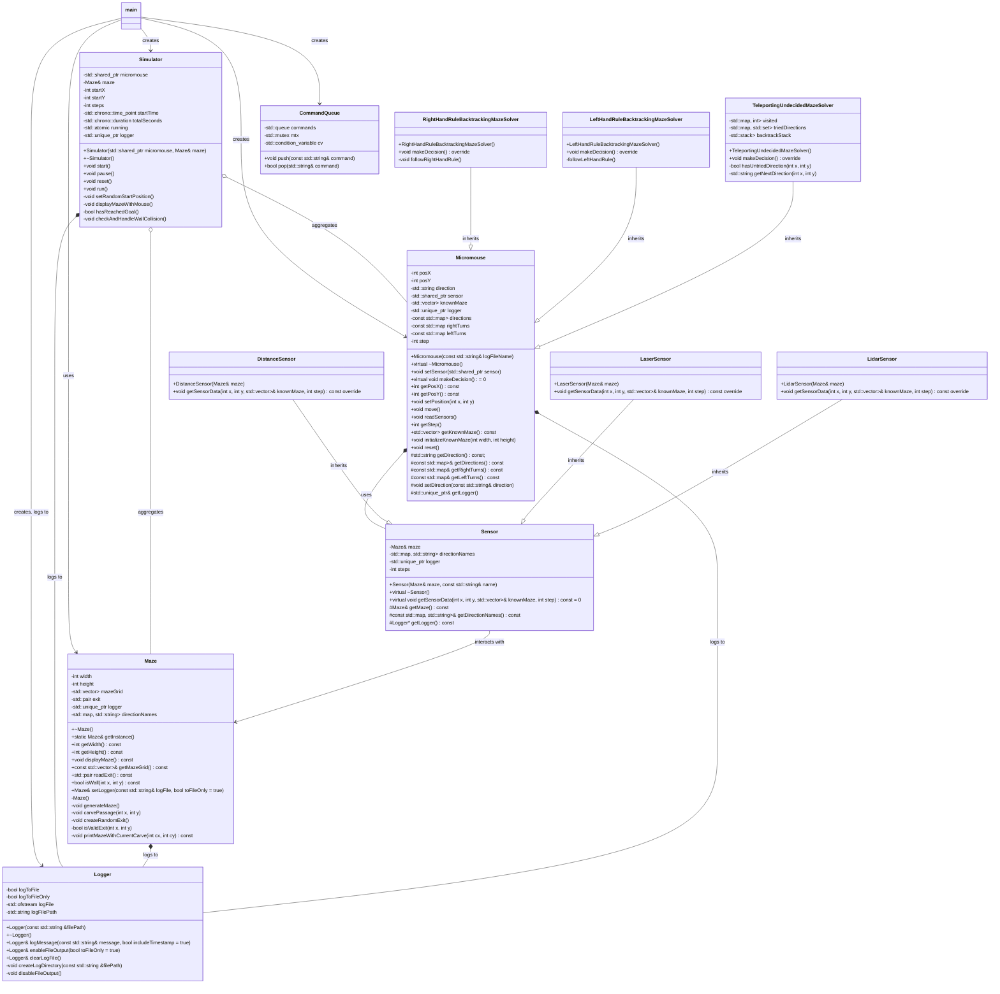

<!-- TODO

Patterns collaborate class 
GL course

check class diagram
project functionalities/ description
double check everything
  -->

# Micromouse Simulator

This project aims to create a simulation of a micromouse robot tasked with navigating through a maze. The robot will be equipped with sensors that allow it to gather data about its surroundings and make movement decisions based on that data. The simulation will include a visualization of the robot's movement within the maze.

## Functionality

**Maze Generation and Display**
   - The maze will be generated randomly and displayed in the terminal, showing both walls and open spaces.

**Robot Movement Simulation**
   - The robot will navigate through the maze, analyzing sensor data and making movement decisions based solely on internal data. The robot's movement will be visualized on the screen.

**Robot Sensors**
   - The robot will be equipped with distance sensors (front, left, right) to assess the distance to the nearest wall in those directions.

**Navigation Algorithm**
   - The robot will use simple navigation algorithms, such as prioritizing the right or left direction when making movement decisions.

**User Interface**
   - The program will feature a simple console-based user interface, allowing users to start the simulation, pause, reset, and exit.

**Progress Reporting**
   - The program will display information about the robot's progress, such as the number of steps taken and the simulation time.

## Table of Contents
1. [Project Structure](#project-structure)
2. [Installation and Environment Setup](#installation-and-environment-setup)
   - [Prerequisites](#Prerequisites)
3. [Running the Project](#running-the-project)
4. [Documentation](#documentation)

<!-- 5. [Detailed Program Operation](#detailed-program-operation)
   - [Step 1: Extracting Data](#step-1-extracting-data)
   - [Step 2: Data Processing](#step-2-data-processing)
   - [Optional Step: Visualizing Sample Data](#optional-step-visualizing-sample-data)
   - [Step 3: Training Gaussian Bayes Classifier](#step-3-training-gaussian-bayes-classifier)
   - [Step 4: Training Histogram Bayes Classifier](#step-4-training-histogram-bayes-classifier)
   - [Optional Step: Visualization of Histograms for a Given Class](#optional-step-visualization-of-histograms-for-a-given-class)
   - [Step 5: Classification - Parametric Bayesian ML Classifier](#step-5-classification-parametric-bayesian-ml-classifier)
   - [Step 6: Classification - Non-parametric Bayesian Classifier](#step-6-classification-non-parametric-bayesian-classifier) -->

6. [Log Files](#log-files)

    - [`main.log`](#mainlog)
    - [`simulator.log`](#simulatorlog)
    - [`maze.log`](#mazelog)
    - [`micromouse.log`](#micromouselog)
    - [`sensor.log`](#sensorlog)
- [Log file examples](#log-file-examples)

7. [Class Diagram](#class-diagram)
<!-- 8. [Description of project files](#description-of-project-files)
   - [`control/logger_utils.py`](#controllogger_utilspy)
   - [`debug/debug_visualize_samples.py`](#debugdebug_visualize_samplespy)
   - [`problem/gtsrb.py`](#problemgtsrbpy)
   - [`problem/hu_image_data.py`](#problemhu_image_datapy)
   - [`setup/setup.bat`](#setupsetupbat)
   - [`setup/setup.sh`](#setup/setupsh)
   - [`method/gaussian_bayes.py`](#methodgaussian_bayespy)
   - [`method/histogram_bayes.py`](#methodhistogram_bayespy)  -->

## Project Structure

        MicromouseProject/
        ├── docs/
        │   └── Doxyfile
        ├── include/
        │   ├── Logger.h
        │   ├── Maze.h
        │   ├── Micromouse.h
        │   ├── Sensor.h
        │   ├── Simulator.h
        │   └── Utils.h
        ├── src/
        │   ├── main.cpp
        │   ├── Logger.cpp
        │   ├── Maze.cpp
        │   ├── Micromouse.cpp
        │   ├── Sensor.cpp
        │   ├── Simulator.cpp
        │   └── Utils.cpp
        ├── tests/
        │   └── test_maze.cpp
        ├── .gitignore
        ├── build.sh
        ├── CMakeLists.txt
        └── README.md

## Installation and environment setup

### Prerequisites

Ensure the following tools are installed on your system:

- C++17 or higher
- CMake 3.10 or higher

- Google Test Framework
```sh
git clone https://github.com/google/googletest.git
cd googletest
mkdir build
cd build
cmake ..
make
sudo make install
```
- Doxygen
```sh
sudo apt install doxygen
```

## Running the project

```sh
./build.sh [options]
Options:
    --help: Displays usage help.
    --test: Builds and runs tests without running the main application.
    --clean: Cleans build and output directories.
    --debug: Builds the project in debug mode.
    --doc: Generates Doxygen documentation.
```

`build.sh`

The provided build.sh script is a Bash script designed to automate the build process, testing, cleaning, documentation generation, and running of a C++ project configured with CMake. This script provides a robust automation solution for managing the build, testing, cleaning, and documentation generation processes for a C++ project using CMake. It ensures dependencies like CMake, and Doxygen are present, and handles each task in a systematic and error-aware manner. Adjustments can be made as needed to tailor it further to specific project requirements or additional dependencies.

`CMakeLists.txt`

The provided CMakeLists.txt file is used to configure the build process for a project named MicromouseProject. It sets up compilation options, includes necessary libraries like Qt5 and Google Test, and defines targets for both the main executable and test executable. This CMakeLists.txt file effectively configures the build system for a C++ project involving Qt5 for GUI components and Google Test for unit testing. It separates the main executable build (MicromouseProject) from the test executable (tests), ensuring that both production and testing code are handled appropriately during compilation and linking. The file demonstrates best practices for integrating external libraries (Qt5 and Google Test) and setting up a comprehensive build environment for a C++ project.


## Documentation

To generate the project documentation, use the --doc option with the build.sh script. The documentation will be generated using Doxygen.

```sh
./build.sh --doc
```

The generated documentation can be found in the ./docs/html directory. Open the index.html file in a web browser to view the documentation.

## Detailed program overview

## Log files

#### `main.log`

The provided code (main.log and main.cpp) showcases a structured approach to simulating micromouse behavior in a maze environment. It employs threads for managing user commands and simulator actions, ensuring smooth interaction and proper synchronization. The logging mechanism (Logger class) is utilized to record important events and commands during the simulation, aiding in monitoring and debugging the program's execution.

The main.log file serves as a chronological record of events and user commands throughout the micromouse simulation program. It documents the initialization of key components such as the maze, micromouse, and simulator, as well as user interactions that control the simulation's flow (start, pause, reset, exit). Each log entry provides insights into the program's execution timeline, facilitating monitoring, debugging, and understanding of the simulation's behavior and outcomes.

#### `simulator.log`

The provided log file simulator.log documents the activities and events during the execution of a micromouse simulation. The log file simulator.log serves as a detailed record of the micromouse simulation's progress, capturing initialization, grid representations, steps taken, and simulation time. It is essential for debugging, performance analysis, and understanding the behavior of the micromouse within the simulated maze environment. Each entry provides insight into the state of the simulation at specific points in time, aiding in understanding its execution flow and outcomes.

#### `maze.log`

The log file maze.log effectively tracks the maze generation process, carving of passages, and updates to the maze grid. It provides a comprehensive view of how the maze is constructed and logged in real-time. This level of logging is useful for debugging, understanding maze generation algorithms, and visualizing the state of the maze throughout its creation process.

#### `sensor.log`

The sensor.log file captures the output of the micromouse's sensor as it scans the maze environment, detecting walls and logging its findings. 

#### `micromouse.log`

The provided log file details a simulation or execution log of a Micromouse robot navigating through a maze, using different maze solving algorithms based on the right-hand rule, left-hand rule, and a teleporting undecided strategy. 

The log file provides a detailed record of the Micromouse's journey through the maze, reflecting the implementation of different maze-solving algorithms. Each step is logged to track the Micromouse's position, sensor readings, decision-making process, and algorithm-specific behavior. This structured logging is crucial for debugging, analyzing performance, and understanding the behavior of the maze-solving algorithms implemented in the Micromouse simulation.


## Log file examples

#### Example entry in `main.log`:

```
[2024-06-27 00:31:04] Creating the Maze...
[2024-06-27 00:31:04] Displaying maze:
# # # # # # # # # # # #   # # # # # # # # 
#       #       #           #           # 
#   #   #   #   # # #   #   # # #   #   # 
#   #       #           #       #   #   # 
#   # # # # # # # # # # # # #   # # #   # 
#   #                       #   #       # 
#   #   #   # # # # # # # # #   #   #   # 
#   #   #           #           #   #   # 
#   # # #   # # #   #   # # # # #   #   # 
#       #       #   #               #   # 
#   #   # # # # #   # # # # # # # # #   # 
#   #           #   #               #   # 
#   # # # # #   #   #   # # #   #   #   # 
#       #   #   #   #       #   #   #   # 
# # #   #   #   #   # # #   #   # # #   # 
#           #   #           #           # 
# # # # # # #   #   # # # # # # # # # # # 
#           #   #           #           # 
#   # # #   #   # # # # #   # # # # #   # 
#   #           #                       # 
# # # # # # # # # # # # # # # # # # # # # 
[2024-06-27 00:31:04] Creating the Micromouse...
[2024-06-27 00:31:06] Creating the Simulator...
[2024-06-27 00:31:06] Running the simulation. Started a thread to handle user input for start/pause/reset/exit
[2024-06-27 00:31:07] Command executed: start
[2024-06-27 00:31:12] Command executed: stop
[2024-06-27 00:31:14] Command executed: start
[2024-06-27 00:31:15] Command executed: stop
[2024-06-27 00:31:16] Command executed: start
[2024-06-27 00:31:20] Command executed: exit
[2024-06-27 00:31:20] Simulation finished.
```

#### Example entry in `simulator.log`:

```
? ? ? ? ? ? ? ? ? ? ? ? ? ? ? ? ? ? ? ? ? 
? ? ? ? ? ? ? ? ? ? ? ? ? ? ? ? ? ? ? ? ? 
? ? ? ? ? ? ? ? ? ? ? ? ? ? ? ? ? ? ? ? ? 
? ? ? ? ? ? ? ? ? ? ? ? ? ? ? ? ? ? ? ? ? 
? ? ? ? ? ? ? ? ? ? ? ? ? ? ? ? ? ? ? ? ? 
? ? ? ? ? ? ? ? ? ? ? ? ? ? ? ? ? ? ? ? ? 
? ? ? ? ? ? ? ? ? ? ? ? ? ? ? ? ? ? ? ? ? 
? ? ? ? ? ? ? ? ? ? ? ? ? ? ? ? ? ? ? ? ? 
? ? ? ? ? ? ? ? ? ? ? ? ? ? ? ? ? ? ? ? ? 
? ? ? ? ? ? ? ? ? ? ? ? ? ? ? ? ? ? ? ? ? 
? ? ? ? ? ? ? ? ? ? ? ? ? ? ? ? ? ? ? ? ? 
? ? ? ? ? ? ? ? ? ? ? ? ? ? ? ? ? ? ? ? ? 
? ? ? ? ? ? ? ? ? ? ? ? ? ? ? ? ? ? ? ? ? 
? ? ? ? ? ? ? ? ? ? ? ? ? ? ? ? ? ? ? ? ? 
? ? ? ? ? ? ? ? ? ? ? ? ? ? ? ? ? ? ? ? ? 
? ? ? ? ? ? ? ? ? ? ? ? ? ? ? ? ? ? ? ? ? 
? # # # # # ? ? ? ? ? ? ? ? ? ? ? ? ? ? ? 
#           # ? ? ? ? ? ? ? ? ? ? ? ? ? ? 
#   # # #   # ? ? ? ? ? ? ? ? ? ? ? ? ? ? 
#   # ? M     ? ? ? ? ? ? ? ? ? ? ? ? ? ? 
? # ? ? ? # ? ? ? ? ? ? ? ? ? ? ? ? ? ? ? 
[2024-06-27 00:31:07] Steps taken: 9
[2024-06-27 00:31:07] Simulation time: 0.409660 seconds
? ? ? ? ? ? ? ? ? ? ? ? ? ? ? ? ? ? ? ? ? 
? ? ? ? ? ? ? ? ? ? ? ? ? ? ? ? ? ? ? ? ? 
? ? ? ? ? ? ? ? ? ? ? ? ? ? ? ? ? ? ? ? ? 
? ? ? ? ? ? ? ? ? ? ? ? ? ? ? ? ? ? ? ? ? 
? ? ? ? ? ? ? ? ? ? ? ? ? ? ? ? ? ? ? ? ? 
? ? ? ? ? ? ? ? ? ? ? ? ? ? ? ? ? ? ? ? ? 
? ? ? ? ? ? ? ? ? ? ? ? ? ? ? ? ? ? ? ? ? 
? ? ? ? ? ? ? ? ? ? ? ? ? ? ? ? ? ? ? ? ? 
? ? ? ? ? ? ? ? ? ? ? ? ? ? ? ? ? ? ? ? ? 
? ? ? ? ? ? ? ? ? ? ? ? ? ? ? ? ? ? ? ? ? 
? ? ? ? ? ? ? ? ? ? ? ? ? ? ? ? ? ? ? ? ? 
? ? ? ? ? ? ? ? ? ? ? ? ? ? ? ? ? ? ? ? ? 
? ? ? ? ? ? ? ? ? ? ? ? ? ? ? ? ? ? ? ? ? 
? ? ? ? ? ? ? ? ? ? ? ? ? ? ? ? ? ? ? ? ? 
? ? ? ? ? ? ? ? ? ? ? ? ? ? ? ? ? ? ? ? ? 
? ? ? ? ? ? ? ? ? ? ? ? ? ? ? ? ? ? ? ? ? 
? # # # # # ? ? ? ? ? ? ? ? ? ? ? ? ? ? ? 
#           # ? ? ? ? ? ? ? ? ? ? ? ? ? ? 
#   # # #   # ? ? ? ? ? ? ? ? ? ? ? ? ? ? 
#   # M       ? ? ? ? ? ? ? ? ? ? ? ? ? ? 
? # ? ? # # ? ? ? ? ? ? ? ? ? ? ? ? ? ? ? 
[2024-06-27 00:31:07] Steps taken: 10
[2024-06-27 00:31:07] Simulation time: 0.460956 seconds
```

#### Example entry in `maze.log`:

```=
[2024-06-27 00:31:04] Displaying maze with current position:
# # # # # # # # # # # # # # # # # # # # # 
# # # # # # # # # # # # # # # # # # # # # 
# # # # # # # # # # # # # # # # # # # # # 
# # # # # # # # # # # # # # # # # # # # # 
# # # # # # # # # # # # # # # # # # # # # 
# # # # # # # # # # # # # # # # # # # # # 
# # # # # # # # # # # # # # # # # # # # # 
# # # # # # # # # # # # # # # # # # # # # 
# # # # # # # # # # # # # # # # # # # # # 
# # # # # # # # # # # # # # # # # # # # # 
# # # # # # # # # # # # # # # # # # # # # 
# # # # # # # # # # # # # # # # # # # # # 
# # # # # # # # # # # # # # # # # # # # # 
# # # # # # # # # # # # # # # # # # # # # 
# # # # # # # # # # # # # # # # # # # # # 
# # # # # # # # # # # # # # # # # # # # # 
# # # # # # # # # # # # # # # # # # # # # 
#           # # # # # # # # # # # # # # # 
#   # # #   # # # # # # # # # # # # # # # 
#   # C     # # # # # # # # # # # # # # # 
# # # # # # # # # # # # # # # # # # # # # 
[2024-06-27 00:31:04] Trying direction South from (3, 1) to (3, -1).
[2024-06-27 00:31:04] Direction South is invalid or already visited.
[2024-06-27 00:31:04] Trying direction West from (3, 1) to (1, 1).
[2024-06-27 00:31:04] Direction West is invalid or already visited.
[2024-06-27 00:31:04] Trying direction North from (3, 1) to (3, 3).
[2024-06-27 00:31:04] Direction North is invalid or already visited.
[2024-06-27 00:31:04] Trying direction East from (3, 1) to (5, 1).
[2024-06-27 00:31:04] Direction East is invalid or already visited.
[2024-06-27 00:31:04] Returning from carving at (3, 1).
[2024-06-27 00:31:04] Trying direction East from (5, 1) to (7, 1).
[2024-06-27 00:31:04] Direction East is valid, moving to (7, 1).
[2024-06-27 00:31:04] Carving passage at (7, 1).
[2024-06-27 00:31:04] Displaying maze with current position:
# # # # # # # # # # # # # # # # # # # # # 
# # # # # # # # # # # # # # # # # # # # # 
# # # # # # # # # # # # # # # # # # # # # 
# # # # # # # # # # # # # # # # # # # # # 
# # # # # # # # # # # # # # # # # # # # # 
# # # # # # # # # # # # # # # # # # # # # 
# # # # # # # # # # # # # # # # # # # # # 
# # # # # # # # # # # # # # # # # # # # # 
# # # # # # # # # # # # # # # # # # # # # 
# # # # # # # # # # # # # # # # # # # # # 
# # # # # # # # # # # # # # # # # # # # # 
# # # # # # # # # # # # # # # # # # # # # 
# # # # # # # # # # # # # # # # # # # # # 
# # # # # # # # # # # # # # # # # # # # # 
# # # # # # # # # # # # # # # # # # # # # 
# # # # # # # # # # # # # # # # # # # # # 
# # # # # # # # # # # # # # # # # # # # # 
#           # # # # # # # # # # # # # # # 
#   # # #   # # # # # # # # # # # # # # # 
#   #         C # # # # # # # # # # # # # 
# # # # # # # # # # # # # # # # # # # # # 
```

#### Example entry in `sensor.log`:

```
[2024-06-27 00:31:07] Step 1: Wall detected to the West at (0, 1)
[2024-06-27 00:31:07] Step 1: Wall detected to the South at (1, 0)
[2024-06-27 00:31:07] Step 1: No wall detected to the North at (1, 2)
[2024-06-27 00:31:07] Step 1: Wall detected to the East at (2, 1)
[2024-06-27 00:31:07] Step 2: Wall detected to the West at (0, 2)
[2024-06-27 00:31:07] Step 2: No wall detected to the South at (1, 1)
[2024-06-27 00:31:07] Step 2: No wall detected to the North at (1, 3)
[2024-06-27 00:31:07] Step 2: Wall detected to the East at (2, 2)
```

#### Example entry in `micromouse.log`:

```
[2024-06-27 00:31:06] Sensor set for Micromouse
[2024-06-27 00:31:06] Step 0: Micromouse position set to (1,1)
[2024-06-27 00:31:07] Step 1: Sensors read at position (1,1)
[2024-06-27 00:31:07] Step 1: Following right-hand rule. Micromouse decided to turn North
[2024-06-27 00:31:07] Step 1: Micromouse moved to (1,2) facing North
[2024-06-27 00:31:07] Step 2: Sensors read at position (1,2)
[2024-06-27 00:31:07] Step 2: Following right-hand rule. Micromouse decided to turn North
[2024-06-27 00:31:07] Step 2: Micromouse moved to (1,3) facing North
```

## Class diagram


<!-- ## Classes Overview

### Simulator
The `Simulator` class controls the simulation of the Micromouse in the maze. It interfaces with the Micromouse and Maze classes to control the Micromouse's movement, manage simulation state, and handle logging of simulation events.


### Micromouse
The `Micromouse` class represents the robot navigating through the maze. It maintains the position, steps taken, and sensors attached to the Micromouse.


### Maze
The `Maze` class represents the maze structure. It is a singleton class, ensuring only one instance of the maze exists.


### Logger
The `Logger` class handles logging messages to a file and optionally to the console.

### Sensor
The `Sensor` class is a base class for different types of sensors that can be attached to the Micromouse.

### CommandQueue
The `CommandQueue` class handles command input in a thread-safe manner using a queue, mutex, and condition variable.

## Main Function

The main function orchestrates the Micromouse simulation by managing user input through CommandQueue, initializing and interacting with the Maze and Micromouse objects, and controlling simulation flow through threads. -->

