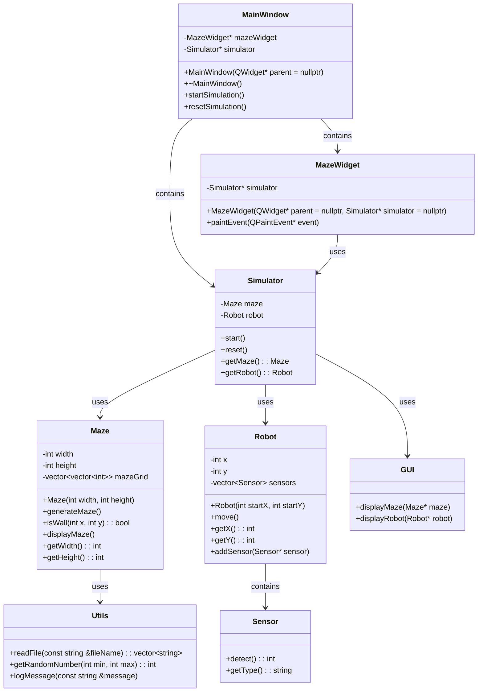

Wstępny Opis Projektu: Symulacja Micromouse

1. Opis Projektu

<!-- TODO
Done:
Logger, Utils, Maze, Simulator

check the teleporting one + main threading

Patterns collaborate class 
GL course
pola zawsze prywatne chyba ze pole jest obiektem ktory sam sie chroni to moze byc protected/public  

Check the documentation
setup doc generation

  -->

Projekt zakłada stworzenie symulacji robota typu micromouse, którego zadaniem jest przejście przez labirynt. Robot będzie wyposażony w czujniki, które pozwolą mu zbierać dane o otoczeniu, i na ich podstawie podejmować decyzje dotyczące ruchu. Symulacja będzie zawierała wizualizację ruchu robota w labiryncie.

2.  Funkcjonalność

    Generowanie i wyświetlanie labiryntu: Labirynt będzie generowany losowo lub wczytywany z pliku. Będzie wyświetlany w interfejsie użytkownika, pokazując zarówno ściany, jak i wolne przestrzenie.
    Symulacja ruchu robota: Robot będzie poruszał się po labiryncie, analizując dane z czujników i podejmując decyzje o kierunku ruchu. Ruch robota będzie wizualizowany na ekranie.
    Czujniki robota: Robot będzie wyposażony w czujniki odległości (na przód, lewo, prawo), które pozwolą mu ocenić odległość do najbliższej ściany w tych kierunkach.
    Algorytm nawigacji: Robot będzie używał prostych algorytmów nawigacji, takich jak śledzenie ściany, aby znaleźć wyjście z labiryntu. Algorytm będzie oparty na lokalnych danych z czujników.
    Interfejs użytkownika: Program będzie posiadał prosty graficzny interfejs użytkownika (GUI), umożliwiający uruchomienie symulacji, pauzowanie, resetowanie oraz modyfikowanie parametrów labiryntu i robota.
    Raportowanie postępów: Program będzie wyświetlał informacje o postępach robota, takie jak liczba kroków, odległość od celu, itp.

3.  Szkic Interfejsu Użytkownika
    3.1. Główne okno aplikacji

        Obszar wyświetlania labiryntu: Centralna część okna, gdzie będzie wyświetlany labirynt i pozycja robota.
        Panel kontrolny: Panel boczny zawierający przyciski sterujące:
        Start/Pauza: Rozpoczęcie lub zatrzymanie symulacji.
        Reset: Zresetowanie symulacji.
        Opcje: Ustawienia parametrów labiryntu i robota.

3.2. Diagram klas

    Micromouse: Klasa reprezentująca robota. Zawiera dane o położeniu, kierunku ruchu, stanach czujników oraz metodach podejmowania decyzji na podstawie lokalnych danych.
    Maze: Klasa reprezentująca labirynt. Zawiera informacje o strukturze labiryntu oraz metodach generowania i wyświetlania labiryntu.
    Simulator: Klasa odpowiedzialna za symulację, zawierająca metody do uruchamiania, pauzowania i resetowania symulacji oraz integrująca klasę Micromouse i Maze.
    GUI: Klasa obsługująca graficzny interfejs użytkownika, odpowiedzialna za rysowanie labiryntu i robota oraz obsługę interakcji użytkownika.

1. Struktura katalogów projektu

        MicromouseProject/
        ├── docs/
        │   └── doxygen_config
        ├── include/
        │   ├── Logger.h
        │   ├── Maze.h
        │   ├── Micromouse.h
        │   ├── Sensor.h
        │   ├── Simulator.h
        │   └── Utils.h
        ├── src/
        │   ├── Logger.cpp
        │   ├── Maze.cpp
        │   ├── Micromouse.cpp
        │   ├── Sensor.cpp
        │   ├── Simulator.cpp
        │   └── Utils.cpp
        ├── tests/
        │   └── test_maze.cpp
        ├── .gitignore
        ├── build.sh
        ├── CMakeLists.txt
        ├── main.cpp
        └── README.md

Dependencies:

<!-- ###### QT5

sudo apt install qt5-default -->

###### Google Test

git clone https://github.com/google/googletest.git
cd googletest
mkdir build
cd build
cmake ..
make
sudo make install

####### Doxygen

sudo apt install doxygen clang llvm

## Opis diagramu:

    Simulator: Zarządza instancjami Maze i Robot, oraz kontroluje symulację.
    Maze: Reprezentuje labirynt, zawiera siatkę z komórkami labiryntu oraz metody do generowania i wyświetlania labiryntu.
    Robot: Reprezentuje robota w labiryncie, przechowuje jego pozycję oraz sensory.
    Sensor: Reprezentuje czujnik robota, wykrywa otoczenie.
    GUI: Odpowiada za wyświetlanie labiryntu i robota, ale w tej strukturze jest to klasa abstrakcyjna, bardziej jak koncept.
    MainWindow: Główne okno aplikacji Qt, zawiera widget labiryntu oraz instancję symulatora.
    MazeWidget: Widget odpowiedzialny za rysowanie labiryntu i robota.
    Utils: Zawiera funkcje pomocnicze, takie jak czytanie plików, generowanie liczb losowych oraz logowanie wiadomości.

Sensor

Sensor Class

The Sensor class serves as a base class for various sensors used in a maze environment. It provides common functionality and data members that are shared among different sensor types.
Constructor and Destructor

    Constructor: Sensor(Maze* maze, const std::string& name)
        Initializes the sensor with a pointer to a Maze object and a name for identification.
        Sets up a unique Logger object specific to the sensor's name for logging purposes.
        Initializes directionNames, a map that associates direction vectors with their corresponding names (e.g., {{-1, 0}, "West"}).
        Enables file output for logging and clears any existing log files.

    Destructor: virtual ~Sensor()
        Ensures proper cleanup by disabling file output for logging when the sensor object is destroyed.

Virtual Function

    Virtual Function: virtual void getSensorData(int x, int y, std::vector<std::vector<int>>& knownMaze, int step) const = 0;
        A pure virtual function that must be implemented by derived sensor classes.
        Retrieves sensor data for a specific coordinate (x, y) in the maze and updates knownMaze, a 2D vector representing the maze's state.
        step parameter indicates the current step or iteration count during data retrieval.

Data Members

    Data Members:
        maze: Pointer to the Maze object that represents the maze environment.
        directionNames: A map that associates direction vectors (std::pair<int, int>) with human-readable direction names (std::string).
        logger: Unique pointer to a Logger object used for logging sensor activities.
        steps: Integer variable that counts the number of steps or iterations.

Summary

The Sensor class encapsulates common functionality and data members needed by various sensor types in a maze navigation or mapping scenario. It manages logging activities, maintains direction mappings, and ensures proper initialization and cleanup of resources. Derived sensor classes extend this base functionality by implementing the getSensorData method according to their specific sensor behavior.

This architecture supports modular and extensible sensor implementations, enabling efficient management and utilization of sensor data within the maze environment.

DistanceSensor Class

The DistanceSensor class represents a sensor used for detecting obstacles (walls) in orthogonal directions (North, South, East, West) from a specific coordinate (x, y) in a maze environment. It inherits from a base class Sensor.
Constructor

    Constructor: DistanceSensor(Maze* maze)
        Initializes the sensor with a pointer to a Maze object, which represents the environment where the sensor operates.

getSensorData Function

The getSensorData function retrieves sensor data for a given coordinate (x, y) in the maze and updates a 2D vector knownMaze to reflect the detection results.
Parameters

    x, y: Coordinates within the maze where the sensor is positioned.
    knownMaze: A 2D vector that maintains the current known state of the maze, where 0 indicates no wall and 1 indicates a wall.
    step: Current step number or iteration count.

Behavior

    Functionality:
        Initializes knownMaze[x][y] to 0, indicating no wall at the starting position (x, y).
        Iterates through predefined directions (North, South, East, West) to scan for walls:
            Calculates coordinates (nx, ny) in each direction relative to (x, y).
            Checks if (nx, ny) is within the bounds of knownMaze.
            If within bounds, checks if there is a wall (maze->isWall(nx, ny)):
                Updates knownMaze and logs a message indicating whether a wall was detected or not.
            If (nx, ny) is out of bounds, logs an appropriate message indicating the boundary breach.

Logging

    Logging:
        Utilizes a logger to log messages indicating:
            Detection of walls (Wall detected) or absence of walls (No wall detected) in each direction (North, South, East, West).
            Out-of-bounds conditions encountered during scanning in each direction.

Summary

The DistanceSensor class provides functionality to scan orthogonal directions from a starting position (x, y) within a maze. It uses a Maze object to query the environment and updates a 2D vector (knownMaze) to maintain a representation of the maze's layout based on sensor readings. The getSensorData function handles scanning for walls, logs detection results, and manages boundary conditions to ensure accurate mapping of the maze environment.

This setup is beneficial for applications requiring obstacle detection and spatial awareness within a maze-like environment, facilitating navigation or mapping tasks effectively.

Logger

Logger Class

The Logger class provides functionality for logging messages to a file and/or the console.
Constructor

    Constructor: Logger(const std::string& filePath)
        Initializes the Logger object with the path to the log file (filePath).
        Calls createLogDirectory to ensure the directory structure exists for the log file.

Public Methods

    logMessage: Logs a message to both the file (if enabled) and the console.
        Parameters:
            message: The message to log.
            includeTimestamp (optional): Indicates whether to include a timestamp in the logged message.
        Returns a reference to the Logger object.
        If logToFile is true, writes the formatted message to the log file (logFile) and optionally to the console.
        If logToFile is false, logs the message only to the console.

    enableFileOutput: Enables logging to a file.
        Parameters:
            toFileOnly (optional): Specifies whether to log exclusively to the file or also to the console.
        Returns a reference to the Logger object.
        Opens the log file (logFilePath) for appending (std::ios::app mode).
        Sets logToFile to true and logToFileOnly based on the provided parameter.
        Displays debug messages (if DEBUG_MODE is defined) about the logging configuration.

    disableFileOutput: Disables logging to the file.
        Returns a reference to the Logger object.
        Closes the log file (logFile) if it is currently open.
        Resets logToFile and logToFileOnly to false.
        Prints debug information (if DEBUG_MODE is defined) confirming the change in logging behavior.

    clearLogFile: Clears the contents of the log file.
        Returns a reference to the Logger object.
        Uses Utils::clearFile to truncate the log file (logFilePath).

Private Methods

    createLogDirectory: Creates the directory structure for the log file if it doesn't exist.
        Extracts the directory path from logFilePath and uses Utils::createDirectory to ensure the directory exists.

Data Members

    logToFile: Indicates if logging to the file is enabled.
    logToFileOnly: Indicates if logging exclusively to the file is enabled.
    logFile: Output file stream used for logging messages to the file.
    logFilePath: Path to the log file.

Summary

The Logger class encapsulates functionality for logging messages with optional timestamps to a specified file path. It supports enabling/disabling file output, clearing the log file, and managing logging behavior between file and console outputs. This setup facilitates organized logging in applications, aiding in debugging, monitoring, and analysis tasks. The class ensures efficient file handling and robust logging capabilities within a program.

Maze Class

The Maze class represents a maze structure and provides various functionalities related to its generation, manipulation, and logging.
Constructor and Singleton Pattern

    Constructor: Maze()
        Private constructor to prevent direct instantiation.
        Initializes width and height of the maze (default: 21x21).
        Initializes mazeGrid as a 2D vector representing the maze, initially filled with walls (1).
        Initializes logger using Logger class to log maze operations to a specified log file (./logs/maze.log).
        Initializes directionNames to map direction offsets ({{-1, 0}, "West"}, {1, 0}, "East"}, {0, -1}, "South"}, {0, 1}, "North"}).

Destructor

    Destructor: ~Maze()
        Cleans up by disabling file output for logging (logger->disableFileOutput()).
        Deletes the singleton instance (instance).

Singleton Instance

    getInstance(): Returns the single instance of Maze.
        Implements the singleton pattern to ensure only one instance of Maze exists.
        If instance doesn't exist, creates a new Maze object.

Public Methods

    Accessors: getWidth(), getHeight()
        Returns the width and height of the maze.

    displayMaze()
        Logs the current state of the maze (mazeGrid) to the logger.
        Formats the maze with walls (#) and spaces for empty spaces.
        Uses logger->logMessage() to display each row of the maze.

    getMazeGrid()
        Returns a constant reference to the maze grid (mazeGrid).

    readExit()
        Returns the coordinates of the maze exit as a pair (exit).

    isWall(int x, int y)
        Checks if the cell at coordinates (x, y) is a wall (1).
        Returns true if the cell is a wall, otherwise false.

    setLogger(const std::string& logFile, bool toFileOnly = true)
        Sets the logger for the maze with a specified log file path (logFile).
        Optionally specifies whether to log only to the file (toFileOnly).
        Uses Logger class methods to configure and enable logging.

Private Methods

    Maze Generation: generateMaze(), carvePassage(int x, int y), createRandomExit()

        generateMaze(): Initiates maze generation process.
            Calls carvePassage(1, 1) to start carving passages from the maze's starting point.
            Calls createRandomExit() to randomly create an exit on the maze's border.

        carvePassage(int x, int y): Recursively carves passages from the given coordinates (x, y).
            Uses a depth-first search approach to carve paths (0) through the maze.
            Logs each step of the carving process using logger->logMessage().

        createRandomExit(): Randomly selects a valid border cell and designates it as the maze exit.
            Uses isValidExit(int x, int y) to verify the selected cell is suitable for an exit.
            Logs the creation of the exit using logger->logMessage().

    Validation: isValidExit(int x, int y)
        Checks if a potential exit at coordinates (x, y) meets the criteria for a valid exit:
            Must be adjacent to open spaces (0) in the maze grid.

    Utility: printMazeWithCurrentCarve(int cx, int cy)
        Logs the current state of the maze with an indication (C) of the current position being carved.

Summary

The Maze class encapsulates maze generation and manipulation logic, providing methods to retrieve maze dimensions, display the maze, access maze grid data, and manage logging of maze operations. It employs the singleton pattern to ensure a single instance exists throughout the program's execution, enhancing consistency and control over maze generation and logging activities. This design facilitates organized development and debugging of maze-related applications.

LaserSensor Class

The LaserSensor class represents a sensor used for detecting walls in multiple directions (North, South, East, West) starting from a specific coordinate (x, y) in a maze environment. It inherits from a base class Sensor.
Constructor

    Constructor: LaserSensor(Maze* maze)
        Initializes the sensor with a pointer to a Maze object, which represents the environment where the sensor operates.

getSensorData Function

The getSensorData function retrieves sensor data for a starting coordinate (x, y) in the maze and updates a 2D vector knownMaze to reflect the detection results.
Parameters

    x, y: Starting coordinates within the maze where the sensor is positioned.
    knownMaze: A 2D vector that maintains the current known state of the maze, where 0 indicates no wall and 1 indicates a wall.
    step: Current step number or iteration count.

Behavior

    Functionality:
        Checks if the starting position (x, y) is within the maze bounds. If not, logs an out-of-bounds message and exits.
        Initializes knownMaze[x][y] to 0, indicating no wall at the starting position.
        Iterates through predefined directions (North, South, East, West) to scan for walls:
            Continues scanning in each direction until a wall (maze->isWall(nextX, nextY) returns true) or an out-of-bounds condition is encountered.
            Updates knownMaze accordingly based on whether a wall is detected or not.
            Logs messages detailing each detection step, including whether a wall was detected or not and the coordinates involved.

Logging

    Logging:
        Utilizes a logger to log messages indicating:
            Detection of walls or open spaces (Laser detected wall or Laser detected no wall) in each direction (North, South, East, West).
            Out-of-bounds conditions encountered during scanning in each direction.

Summary

The LaserSensor class provides functionality to scan multiple directions from a starting position (x, y) within a maze. It uses a Maze object to query the environment and updates a 2D vector (knownMaze) to maintain a representation of the maze's layout based on sensor readings. The getSensorData function handles scanning for walls in orthogonal directions, logs detection results, and manages boundary conditions, ensuring accurate mapping of the maze environment.

This setup is useful for applications involving maze exploration or obstacle detection where a detailed scan of adjacent positions is necessary for navigation or mapping purposes.

LidarSensor Class

The LidarSensor class represents a sensor used for detecting walls and open spaces (no walls) in a maze environment. It inherits from a base class Sensor.
Constructor

    Constructor: LidarSensor(Maze* maze)
        Initializes the sensor with a pointer to a Maze object, which represents the environment where the sensor operates.

getSensorData Function

The getSensorData function retrieves sensor data for a specific coordinate (x, y) in the maze and updates a 2D vector knownMaze to reflect the detection results.
Parameters

    x, y: Coordinates within the maze where the sensor is positioned.
    knownMaze: A 2D vector that maintains the current known state of the maze, where 0 indicates no wall and 1 indicates a wall.
    step: Current step number or iteration count.

Behavior

    Functionality:
        The function iterates over a 5x5 grid (from -2 to 2 for both dx and dy).
        It skips the center (x, y) position (dx = 0, dy = 0).
        For each adjacent position (nx, ny) within the maze boundaries:
            Updates knownMaze based on whether maze->isWall(nx, ny) returns true (wall detected) or false (no wall detected).
            Logs the detection result and direction relative to the current (x, y) position.
        Handles out-of-bounds scenarios by logging these occurrences.

Logging

    Logging:
        Utilizes a logger to log messages indicating:
            Whether a wall or open space is detected.
            The direction relative to the current position (Current position, North, South, East, West, etc.).
            Indicates when a position is out of bounds.

Summary

The LidarSensor class provides functionality to detect walls and open spaces around a specific coordinate in a maze. It uses a Maze object to query the environment and updates a 2D vector (knownMaze) to maintain a representation of the maze's layout based on sensor readings. The getSensorData function handles adjacent positions, logs detection results, and manages boundary conditions, ensuring accurate mapping of the maze environment.

This setup is useful for applications involving maze navigation or mapping where real-time detection of obstacles is crucial for decision-making processes.

Simulator

The Simulator class manages the simulation of a Micromouse navigating through a Maze.
Constructor and Destructor

    Constructor: Simulator(std::shared_ptr<Micromouse> micromouse, Maze* maze)
        Initializes micromouse with a shared pointer to a Micromouse object.
        Initializes maze with a pointer to a Maze object.
        Sets initial values for startX, startY, steps, startTime, totalSeconds, running, and initializes logger.
        Calls setRandomStartPosition() to set a random start position for the micromouse.
        Configures the logger (logger) to output to "logs/simulator.log", clears the log file, and logs initialization.

    Destructor: ~Simulator()
        Cleans up by disabling file output for logging (logger->disableFileOutput()).

Public Methods

    run()
        Starts the simulation loop:
            Sets running to true.
            If startTime is uninitialized, sets it to the current time.
            Loops until running is false or the micromouse reaches the maze exit (hasReachedGoal()):
                Calls micromouse->move() to simulate the micromouse movement.
                Updates steps with the micromouse's step count (micromouse->getStep()).
                Displays the maze with the micromouse's current position (displayMazeWithMouse()).
                Checks for wall collisions (checkAndHandleWallCollision()).
                Pauses for 50 milliseconds using std::this_thread::sleep_for() to control simulation speed.
            Logs completion of the simulation or pause if the micromouse reaches the goal or simulation is paused.

    start()
        Starts or resumes the simulation:
            If running is false, spawns a detached thread to execute run() in parallel.
            Logs that the simulation has started.

    pause()
        Pauses the simulation:
            Sets running to false.
            Logs that the simulation has been paused.

    reset()
        Resets the simulation:
            If running is false, resets steps, startTime, totalSeconds, and the micromouse's position using micromouse->reset() and setRandomStartPosition().
            Logs the reset operation or an error message if the simulation is running.

Private Methods

    setRandomStartPosition()
        Sets a random starting position (startX, startY) for the micromouse within the maze:
            Uses a random number generator (std::random_device, std::mt19937, std::uniform_int_distribution) to select a corner of the maze.
            Updates micromouse's position and logs the micromouse's starting coordinates.

    displayMazeWithMouse()
        Displays the current state of the maze with the micromouse's position:
            Retrieves the micromouse's known maze grid (grid) and current position (mouseX, mouseY).
            Constructs a string representation of each row in the maze, indicating the micromouse's position ('M'), unknown areas ('?'), walls ('#'), and empty spaces (' ').
            Logs each row of the maze and additional simulation details (steps taken, simulation time).

    hasReachedGoal()
        Checks if the micromouse has reached the maze exit:
            Retrieves the exit coordinates from maze using maze->readExit().
            Compares the micromouse's current position (micromouse->getPosX(), micromouse->getPosY()) with the exit coordinates.
            Returns true if the micromouse is at the exit, otherwise false.

    checkAndHandleWallCollision()
        Checks if the micromouse has collided with a wall:
            Retrieves the micromouse's current position (currentX, currentY).
            Uses maze->isWall(currentX, currentY) to check if the cell at (currentX, currentY) is a wall.
            Logs a collision message and terminates the simulation if a collision is detected (exit(0)).

Summary

The Simulator class orchestrates the simulation of a micromouse navigating through a maze. It interfaces with the Micromouse and Maze classes to control the micromouse's movement, manage simulation state, and handle logging of simulation events. This structured approach allows for clear separation of concerns and facilitates effective simulation management and monitoring.

