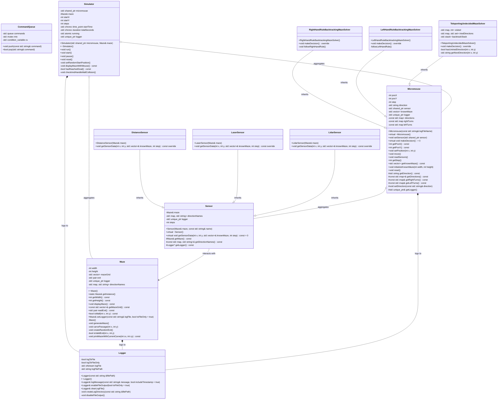

# Micromouse Simulator

Project made for C++ course at Warsaw University of Technology.

This program simulates a Micromouse navigating through a maze. The primary components of the program include the maze, the micromouse, and the simulator that orchestrates the simulation. The program allows for user interaction to start, pause, reset, and exit the simulation. This document provides a detailed overview of the program, including its structure, functionalities, and usage.

## Functionalities

- The maze will be generated randomly and displayed in the terminal, showing both walls and open spaces.
- The robot will be equipped with sensors to allow the micromouse to make a decision in which direction to move in the next iteration.
- The robot will navigate through the maze, analyzing sensor data and making movement decisions based solely on internal data. The robot's movement will be visualized on the screen.
- The robot will use simple navigation algorithms, such as prioritizing the right or left direction when making movement decisions.
- The program will feature a simple console-based user interface, allowing users to start the simulation, pause, reset, and exit.
- The program will display information about the robot's progress such as the number of steps taken and the simulation time, sensor readings and micromouse decision-making details.

## Table of Contents
1. [Project Structure](#project-structure)
2. [Installation and Environment Setup](#installation-and-environment-setup)
   - [Prerequisites](#Prerequisites)
3. [Running the Project](#running-the-project)
4. [Documentation](#documentation)
5. [Simulation detailed description](#simulation-detailed-description)
    - [Simulation Control](#simulation-control)
    - [Main components](#main-components)
        - [Maze](#maze)
        - [Micromouse](#micromouse)
        - [Sensor](#sensor)
    - [Simulation Behaviour](#simulation-behaviour)
    - [Key features](#key-features)
    - [Simulation Execution](#simulation-execution)
    - [Summary](#summary)
6. [Log Files](#log-files)
    - [`main.log`](#mainlog)
    - [`simulator.log`](#simulatorlog)
    - [`maze.log`](#mazelog)
    - [`micromouse.log`](#micromouselog)
    - [`sensor.log`](#sensorlog)
- [Log file examples](#log-file-examples)
7. [Class Diagram](#class-diagram)
8. [Main classes and functions overview](#main-classes-and-functions-overview)
    - [`Main function`](#main-function)
    - [`CommandQueue`](#commandqueue)
    - [`Simulator`](#simulator)
    - [`Maze`](#maze)
    - [`Micromouse`](#micromouse)
    - [`RightHandRuleBacktrackingMazeSolver`](#RightHandRuleBacktrackingMazeSolver)
    - [`LeftHandRuleBacktrackingMazeSolver`](#LeftHandRuleBacktrackingMazeSolver)
    - [`TeleportingUndecidedMazeSolver`](#TeleportingUndecidedMazeSolver)
    - [`createMicromouse()`](#createmicromouse)
    - [`chooseMicromouse()`](#choosemicromouse)
    - [`Sensor`](#sensor)
    - [`DistanceSensor`](#distancesensor)
    - [`LaserSensor`](#lasersensor)
    - [`LidarSensor`](#lidarsensor)
    - [`Logger`](#logger)
    - [`Utils`](#utils)

## Project Structure

        MicromouseProject/
        ├── docs/
        │   └── Doxyfile
        ├── include/
        │   ├── Logger.h
        │   ├── Maze.h
        │   ├── Micromouse.h
        │   ├── Sensor.h
        │   ├── Simulator.h
        │   └── Utils.h
        ├── src/
        │   ├── main.cpp
        │   ├── Logger.cpp
        │   ├── Maze.cpp
        │   ├── Micromouse.cpp
        │   ├── Sensor.cpp
        │   ├── Simulator.cpp
        │   └── Utils.cpp
        ├── tests/
        │   └── test_maze.cpp
        ├── .gitignore
        ├── build.sh
        ├── CMakeLists.txt
        └── README.md

## Installation and environment setup

### Prerequisites

This setup was tested and should be run on Ubuntu.

Ensure the following tools are installed on your system:

- C++17 or higher
- CMake 3.10 or higher

- Google Test Framework
```
git clone https://github.com/google/googletest.git
cd googletest
mkdir build
cd build
cmake ..
make
sudo make install
```
- Doxygen
```sh
sudo apt install doxygen
```

## Running the project

```
./build.sh [option]

Options:
    --help: Displays usage help.
    --test: Builds and runs tests without running the main application.
    --clean: Cleans build and output directories.
    --debug: Builds the project in debug mode.
    --doc: Generates Doxygen documentation.
```

`build.sh`

The provided build.sh script is a Bash script designed to automate the build process, testing, cleaning, documentation generation, and running of a C++ project configured with CMake. This script provides a robust automation solution for managing the build, testing, cleaning, and documentation generation processes for a C++ project using CMake. It ensures dependencies like CMake, and Doxygen are present, and handles each task in a systematic and error-aware manner. Adjustments can be made as needed to tailor it further to specific project requirements or additional dependencies.

`CMakeLists.txt`

The provided CMakeLists.txt file is used to configure the build process for a project named MicromouseProject. It sets up compilation options, includes necessary libraries like Google Test, and defines targets for both the main executable and test executable. It separates the main executable build (`MicromouseProject`) from the test executable (`tests`), ensuring that both production and testing code are handled appropriately during compilation and linking.


## Documentation

To generate the project documentation, use the `--doc` option with the `build.sh` script. The documentation will be generated using Doxygen.

```sh
./build.sh --doc
```

The generated documentation can be found in the `./docs/html` directory. Open the `index.html` file in a web browser to view the documentation.

## Simulation detailed description

The Micromouse Simulator is an interactive program designed to simulate the behavior of a small autonomous robot, known as a Micromouse, navigating through a maze. This simulation offers users the ability to control and monitor the Micromouse's progress using simple text commands. The program is multi-threaded, ensuring smooth operation and responsiveness.

### Simulation Control

The program utilizes a CommandQueue to manage user commands. This queue ensures that commands are processed in the order they are received and provides thread-safe access to user input.
Two threads are created:

- Input Thread: Continuously waits for user commands and adds them to the command queue.

- Simulation Thread: Processes commands from the queue and controls the simulator accordingly.

The program prompts the user to choose the type of Micromouse and sensor to use in the simulation.

```
Choose Micromouse type:
    1. Right Hand Rule
    2. Left Hand Rule
    3. Teleporting Undecided Solver

Choose Sensor type:
    1. Distance Sensor
    2. Laser Sensor
    3. Lidar Sensor
```

When the user enters a command, it is pushed onto the command queue.
The simulation thread pops commands from the queue and executes them. Depending on the command, the simulator will:
- *```start```*: Begin the simulation, allowing the Micromouse to navigate the maze.
- *```pause```*: Pause the simulation, halting the Micromouse's movement.
- *```reset```*: Reset the simulation, bringing the Micromouse back to its initial state.
- *```exit```*: Exit the simulation.
 
### Main components

###### Maze 
The Maze component is a crucial part of the Micromouse Simulator, providing the environment in which the Micromouse navigates. It is a grid-based maze with walls and passages, generated randomly at the start of the simulation. The depth-first search algorithm is used to carve passages by visiting each cell and creating paths in random directions. The maze includes random exit point that the Micromouse must find.

- Grid Dimensions: The maze is a 21x21 grid, with borders forming the outer walls.
- Walls and Passages: Walls are represented by #, and open passages by spaces ( ).
- Start and Exit Points: The Micromouse starts at a random corner, and the exit is located randomly on one of the borders.

###### Micromouse
The Micromouse component is a versatile simulation tool for testing different maze-solving algorithms and sensors. It provides detailed logging and visualization of the Micromouse's journey through the maze, making it an excellent tool for understanding and analyzing navigation strategies.

Multiple Solvers - different algorithms for navigation:
- Right-Hand Rule: Follows the right-hand rule with backtracking to navigate.
- Left-Hand Rule: Follows the left-hand rule with backtracking to navigate.
- Teleporting Undecided: Checks untried directions and uses backtracking for teleporting to make it seem like the micromouse's behaviour is undefined.


###### Sensor
The Sensor component is crucial for the Micromouse’s navigation, providing real-time data about the maze. Different sensor types offer various levels of detail, and detailed logging helps in understanding and analyzing the navigation process.

Multiple Sensors - different sensor types for various levels of detail and range:
- Distance Sensor: Detects walls in four cardinal directions (North, East, South, West).
- Laser Sensor: Scans in four cardinal directions until a wall is detected.
- Lidar Sensor: Scans a 5x5 area around the Micromouse for walls and open paths.

### Simulation Behaviour

- Start Position: The Micromouse begins at a randomly selected corner of the maze.
- Movement: The Micromouse autonomously moves through the maze, making decisions based on its surroundings.
- Goal: The Micromouse aims to reach a predetermined, random exit point within the maze.
- Collision: If the Micromouse encounters a wall, the simulation pauses, and an appropriate log message is generated

### Key Features

- Type of solver and sensor can be chosen at the initialization of the simulator.
- Thread-Safe Command Processing: Ensures that user inputs are handled efficiently and safely in a multi-threaded environment.
- Responsive Control: Users can start, pause, reset, and exit the simulation with immediate effect.
- Random Maze Generation: Each simulation run generates a unique maze, providing varied challenges for the Micromouse.
- Depth-First Search Algorithm: Ensures that the maze has a solvable path from the start to the exit.
- Random Start Position: Each reset places the Micromouse at a new random start position, providing varied simulation scenarios.
- Random Exit Position: Each run of the simulation generates a unique exit position.
- Collision Detection: The simulator monitors for wall collisions, halting the simulation if a collision occurs.
- Sensors read the maze at the Micromouse’s current position and update its known maze layout.
- Micromouse makes decision where to move based on the sensor data and chosen solver algorithm.
- Dynamic Display: The maze state can be visualized at different stages of the generation and during the simulation.
- Logging: Keeps a detailed record of the simulation’s and main components activities , aiding in debugging and analysis.

### Simulation Execution

- When you start the simulation, the maze is generated and displayed. The Micromouse will begin navigating this randomly generated maze making decisions at each step.
- Micromouse's journey will be logged and displayed periodically, especially when significant events occur.
- The simulation thread updates the Micromouse’s position, checks for wall collisions, and verifies if the Micromouse has reached the goal.
- The simulator pauses if the user enters the pause command or if a wall collision occurs.
- The simulator resets if the user enters the reset command, placing the Micromouse at a new random start position.
- The simulation exits cleanly upon the exit command.

You can observe the Micromouse’s progress in the maze through the console output, analyze the decisions made based on sensor inputs and algorithms.

### Summary

This Micromouse simulator provides an engaging way to explore autonomous navigation algorithms within a maze. By offering simple command-based control, it allows users to easily manage the simulation and observe the behavior of the Micromouse in real-time.


## Log files

The logging mechanism (Logger class) is utilized to record main components states, important events and commands during the simulation, aiding in monitoring and debugging the program's execution.

#### `main.log`

Serves as a chronological record of events and user commands throughout the micromouse simulation program. It documents the initialization of key components such as the maze, micromouse, and simulator, as well as user interactions that control the simulation's flow (start, pause, reset, exit). Each log entry provides insights into the program's execution timeline, facilitating monitoring, debugging, and understanding of the simulation's behavior and outcomes.

#### `simulator.log`

Serves as a detailed record of the micromouse simulation's progress, capturing initialization, grid representations, steps taken, and simulation time. It is essential for debugging, performance analysis, and understanding the behavior of the micromouse within the simulated maze environment. Each entry provides insight into the state of the simulation at specific points in time, aiding in understanding its execution flow and outcomes.

#### `maze.log`

Tracks the maze generation process, carving of passages, and updates to the maze grid. It provides a comprehensive view of how the maze is constructed and logged in real-time. This level of logging is useful for debugging, understanding maze generation algorithms, and visualizing the state of the maze throughout its creation process.

#### `sensor.log`

Captures the output of the micromouse's sensor as it scans the maze environment, detecting walls and logging its findings. 

#### `micromouse.log`
 
Provides a detailed record of the Micromouse's journey through the maze, reflecting the implementation of different maze-solving algorithms. Each step is logged to track the Micromouse's position, sensor readings, decision-making process, and algorithm-specific behavior. This structured logging is crucial for debugging, analyzing performance, and understanding the behavior of the maze-solving algorithms implemented in the Micromouse simulation.


## Log file examples

#### Example entry in `main.log`:

```
[2024-06-27 00:31:04] Creating the Maze...
[2024-06-27 00:31:04] Displaying maze:
# # # # # # # # # # # #   # # # # # # # # 
#       #       #           #           # 
#   #   #   #   # # #   #   # # #   #   # 
#   #       #           #       #   #   # 
#   # # # # # # # # # # # # #   # # #   # 
#   #                       #   #       # 
#   #   #   # # # # # # # # #   #   #   # 
#   #   #           #           #   #   # 
#   # # #   # # #   #   # # # # #   #   # 
#       #       #   #               #   # 
#   #   # # # # #   # # # # # # # # #   # 
#   #           #   #               #   # 
#   # # # # #   #   #   # # #   #   #   # 
#       #   #   #   #       #   #   #   # 
# # #   #   #   #   # # #   #   # # #   # 
#           #   #           #           # 
# # # # # # #   #   # # # # # # # # # # # 
#           #   #           #           # 
#   # # #   #   # # # # #   # # # # #   # 
#   #           #                       # 
# # # # # # # # # # # # # # # # # # # # # 
[2024-06-27 00:31:04] Creating the Micromouse...
[2024-06-27 00:31:06] Creating the Simulator...
[2024-06-27 00:31:06] Running the simulation. Started a thread to handle user input for start/pause/reset/exit
[2024-06-27 00:31:07] Command executed: start
[2024-06-27 00:31:12] Command executed: stop
[2024-06-27 00:31:14] Command executed: start
[2024-06-27 00:31:15] Command executed: stop
[2024-06-27 00:31:16] Command executed: start
[2024-06-27 00:31:20] Command executed: exit
[2024-06-27 00:31:20] Simulation finished.
```

#### Example entry in `simulator.log`:

```
? ? ? ? ? ? ? ? ? ? ? ? ? ? ? ? ? ? ? ? ? 
? ? ? ? ? ? ? ? ? ? ? ? ? ? ? ? ? ? ? ? ? 
? ? ? ? ? ? ? ? ? ? ? ? ? ? ? ? ? ? ? ? ? 
? ? ? ? ? ? ? ? ? ? ? ? ? ? ? ? ? ? ? ? ? 
? ? ? ? ? ? ? ? ? ? ? ? ? ? ? ? ? ? ? ? ? 
? ? ? ? ? ? ? ? ? ? ? ? ? ? ? ? ? ? ? ? ? 
? ? ? ? ? ? ? ? ? ? ? ? ? ? ? ? ? ? ? ? ? 
? ? ? ? ? ? ? ? ? ? ? ? ? ? ? ? ? ? ? ? ? 
? ? ? ? ? ? ? ? ? ? ? ? ? ? ? ? ? ? ? ? ? 
? ? ? ? ? ? ? ? ? ? ? ? ? ? ? ? ? ? ? ? ? 
? ? ? ? ? ? ? ? ? ? ? ? ? ? ? ? ? ? ? ? ? 
? ? ? ? ? ? ? ? ? ? ? ? ? ? ? ? ? ? ? ? ? 
? ? ? ? ? ? ? ? ? ? ? ? ? ? ? ? ? ? ? ? ? 
? ? ? ? ? ? ? ? ? ? ? ? ? ? ? ? ? ? ? ? ? 
? ? ? ? ? ? ? ? ? ? ? ? ? ? ? ? ? ? ? ? ? 
? ? ? ? ? ? ? ? ? ? ? ? ? ? ? ? ? ? ? ? ? 
? # # # # # ? ? ? ? ? ? ? ? ? ? ? ? ? ? ? 
#           # ? ? ? ? ? ? ? ? ? ? ? ? ? ? 
#   # # #   # ? ? ? ? ? ? ? ? ? ? ? ? ? ? 
#   # ? M     ? ? ? ? ? ? ? ? ? ? ? ? ? ? 
? # ? ? ? # ? ? ? ? ? ? ? ? ? ? ? ? ? ? ? 
[2024-06-27 00:31:07] Steps taken: 9
[2024-06-27 00:31:07] Simulation time: 0.409660 seconds
? ? ? ? ? ? ? ? ? ? ? ? ? ? ? ? ? ? ? ? ? 
? ? ? ? ? ? ? ? ? ? ? ? ? ? ? ? ? ? ? ? ? 
? ? ? ? ? ? ? ? ? ? ? ? ? ? ? ? ? ? ? ? ? 
? ? ? ? ? ? ? ? ? ? ? ? ? ? ? ? ? ? ? ? ? 
? ? ? ? ? ? ? ? ? ? ? ? ? ? ? ? ? ? ? ? ? 
? ? ? ? ? ? ? ? ? ? ? ? ? ? ? ? ? ? ? ? ? 
? ? ? ? ? ? ? ? ? ? ? ? ? ? ? ? ? ? ? ? ? 
? ? ? ? ? ? ? ? ? ? ? ? ? ? ? ? ? ? ? ? ? 
? ? ? ? ? ? ? ? ? ? ? ? ? ? ? ? ? ? ? ? ? 
? ? ? ? ? ? ? ? ? ? ? ? ? ? ? ? ? ? ? ? ? 
? ? ? ? ? ? ? ? ? ? ? ? ? ? ? ? ? ? ? ? ? 
? ? ? ? ? ? ? ? ? ? ? ? ? ? ? ? ? ? ? ? ? 
? ? ? ? ? ? ? ? ? ? ? ? ? ? ? ? ? ? ? ? ? 
? ? ? ? ? ? ? ? ? ? ? ? ? ? ? ? ? ? ? ? ? 
? ? ? ? ? ? ? ? ? ? ? ? ? ? ? ? ? ? ? ? ? 
? ? ? ? ? ? ? ? ? ? ? ? ? ? ? ? ? ? ? ? ? 
? # # # # # ? ? ? ? ? ? ? ? ? ? ? ? ? ? ? 
#           # ? ? ? ? ? ? ? ? ? ? ? ? ? ? 
#   # # #   # ? ? ? ? ? ? ? ? ? ? ? ? ? ? 
#   # M       ? ? ? ? ? ? ? ? ? ? ? ? ? ? 
? # ? ? # # ? ? ? ? ? ? ? ? ? ? ? ? ? ? ? 
[2024-06-27 00:31:07] Steps taken: 10
[2024-06-27 00:31:07] Simulation time: 0.460956 seconds
```

#### Example entry in `maze.log`:

```=
[2024-06-27 00:31:04] Displaying maze with current position:
# # # # # # # # # # # # # # # # # # # # # 
# # # # # # # # # # # # # # # # # # # # # 
# # # # # # # # # # # # # # # # # # # # # 
# # # # # # # # # # # # # # # # # # # # # 
# # # # # # # # # # # # # # # # # # # # # 
# # # # # # # # # # # # # # # # # # # # # 
# # # # # # # # # # # # # # # # # # # # # 
# # # # # # # # # # # # # # # # # # # # # 
# # # # # # # # # # # # # # # # # # # # # 
# # # # # # # # # # # # # # # # # # # # # 
# # # # # # # # # # # # # # # # # # # # # 
# # # # # # # # # # # # # # # # # # # # # 
# # # # # # # # # # # # # # # # # # # # # 
# # # # # # # # # # # # # # # # # # # # # 
# # # # # # # # # # # # # # # # # # # # # 
# # # # # # # # # # # # # # # # # # # # # 
# # # # # # # # # # # # # # # # # # # # # 
#           # # # # # # # # # # # # # # # 
#   # # #   # # # # # # # # # # # # # # # 
#   # C     # # # # # # # # # # # # # # # 
# # # # # # # # # # # # # # # # # # # # # 
[2024-06-27 00:31:04] Trying direction South from (3, 1) to (3, -1).
[2024-06-27 00:31:04] Direction South is invalid or already visited.
[2024-06-27 00:31:04] Trying direction West from (3, 1) to (1, 1).
[2024-06-27 00:31:04] Direction West is invalid or already visited.
[2024-06-27 00:31:04] Trying direction North from (3, 1) to (3, 3).
[2024-06-27 00:31:04] Direction North is invalid or already visited.
[2024-06-27 00:31:04] Trying direction East from (3, 1) to (5, 1).
[2024-06-27 00:31:04] Direction East is invalid or already visited.
[2024-06-27 00:31:04] Returning from carving at (3, 1).
[2024-06-27 00:31:04] Trying direction East from (5, 1) to (7, 1).
[2024-06-27 00:31:04] Direction East is valid, moving to (7, 1).
[2024-06-27 00:31:04] Carving passage at (7, 1).
[2024-06-27 00:31:04] Displaying maze with current position:
# # # # # # # # # # # # # # # # # # # # # 
# # # # # # # # # # # # # # # # # # # # # 
# # # # # # # # # # # # # # # # # # # # # 
# # # # # # # # # # # # # # # # # # # # # 
# # # # # # # # # # # # # # # # # # # # # 
# # # # # # # # # # # # # # # # # # # # # 
# # # # # # # # # # # # # # # # # # # # # 
# # # # # # # # # # # # # # # # # # # # # 
# # # # # # # # # # # # # # # # # # # # # 
# # # # # # # # # # # # # # # # # # # # # 
# # # # # # # # # # # # # # # # # # # # # 
# # # # # # # # # # # # # # # # # # # # # 
# # # # # # # # # # # # # # # # # # # # # 
# # # # # # # # # # # # # # # # # # # # # 
# # # # # # # # # # # # # # # # # # # # # 
# # # # # # # # # # # # # # # # # # # # # 
# # # # # # # # # # # # # # # # # # # # # 
#           # # # # # # # # # # # # # # # 
#   # # #   # # # # # # # # # # # # # # # 
#   #         C # # # # # # # # # # # # # 
# # # # # # # # # # # # # # # # # # # # # 
```

#### Example entry in `sensor.log`:

```
[2024-06-27 00:31:07] Step 1: Wall detected to the West at (0, 1)
[2024-06-27 00:31:07] Step 1: Wall detected to the South at (1, 0)
[2024-06-27 00:31:07] Step 1: No wall detected to the North at (1, 2)
[2024-06-27 00:31:07] Step 1: Wall detected to the East at (2, 1)
[2024-06-27 00:31:07] Step 2: Wall detected to the West at (0, 2)
[2024-06-27 00:31:07] Step 2: No wall detected to the South at (1, 1)
[2024-06-27 00:31:07] Step 2: No wall detected to the North at (1, 3)
[2024-06-27 00:31:07] Step 2: Wall detected to the East at (2, 2)
```

#### Example entry in `micromouse.log`:

```
[2024-06-27 00:31:06] Sensor set for Micromouse
[2024-06-27 00:31:06] Step 0: Micromouse position set to (1,1)
[2024-06-27 00:31:07] Step 1: Sensors read at position (1,1)
[2024-06-27 00:31:07] Step 1: Following right-hand rule. Micromouse decided to turn North
[2024-06-27 00:31:07] Step 1: Micromouse moved to (1,2) facing North
[2024-06-27 00:31:07] Step 2: Sensors read at position (1,2)
[2024-06-27 00:31:07] Step 2: Following right-hand rule. Micromouse decided to turn North
[2024-06-27 00:31:07] Step 2: Micromouse moved to (1,3) facing North
```

## Class diagram



## Main classes and functions overview

#### `Main Function`

The main function orchestrates the Micromouse simulation program by managing user input through CommandQueue, initializing and interacting with the Maze and Micromouse objects, and controlling simulation flow through threads (inputThread and simulationThread). It ensures thread-safe command handling and logging of simulation activities, providing a structured approach to simulate and control Micromouse behavior in a maze environment. The main function sets up logging, creates the maze and micromouse objects, and runs the simulation, allowing user commands to start, pause, reset, or exit the simulation.

#### `CommandQueue`
The CommandQueue class handles command input in a thread-safe manner using a queue, mutex, and condition variable. It provides methods to push commands onto the queue and pop commands from the queue, ensuring synchronized access and communication between threads. This design facilitates safe and efficient handling of user commands in a multi-threaded environment.

#### `Simulator`
The Simulator class orchestrates the simulation of a micromouse navigating through a maze. It interfaces with the Micromouse and Maze classes to control the micromouse's movement, manage simulation state, and handle logging of simulation events. This structured approach allows for clear separation of concerns and facilitates effective simulation management and monitoring.

#### `Maze`
Singleton class representing a Maze. The Maze class encapsulates maze generation and manipulation logic, providing methods to retrieve maze dimensions, display the maze, access maze grid data, and manage logging of maze operations. It employs the singleton pattern to ensure a single instance exists throughout the program's execution, enhancing consistency and control over maze generation and logging activities. This design facilitates organized development and debugging of maze-related applications.

#### `Micromouse`
The Micromouse class encapsulates the core functionality and state management for a micromouse navigating and mapping a maze. It provides methods for setting up sensors, making decisions based on sensor data, moving within the maze, and maintaining an updated map (knownMaze). The class also handles initialization, resetting to initial state, and logging of micromouse activities, facilitating systematic maze exploration and navigation. This modular design supports the implementation of various micromouse algorithms by deriving classes that implement specific decision-making strategies (makeDecision()).

#### `RightHandRuleBacktrackingMazeSolver`
The RightHandRuleBacktrackingMazeSolver class extends Micromouse and implements a maze-solving strategy based on the right-hand rule with backtracking. It leverages inherited methods and data members to manage micromouse state, decision-making based on sensor data (knownMaze), and logging of micromouse activities. This algorithmic approach ensures systematic maze exploration and backtracking when encountering dead-ends or blocked paths, aiming to find an optimal route through the maze environment.

#### `LeftHandRuleBacktrackingMazeSolver`
The LeftHandRuleBacktrackingMazeSolver class extends Micromouse and implements a maze-solving strategy based on the left-hand rule with backtracking. It utilizes inherited methods and data members to manage micromouse state, decision-making based on sensor data (knownMaze), and logging of micromouse activities. This algorithmic approach ensures systematic maze exploration and backtracking when encountering dead-ends or blocked paths, aiming to find an optimal route through the maze environment.

#### `TeleportingUndecidedMazeSolver`
The TeleportingUndecidedMazeSolver class extends Micromouse and implements a maze-solving strategy that combines teleporting with an undecided path-solving approach. It utilizes backtracking (backtrackStack) to revisit previous positions and attempt alternative paths when encountering dead-ends or fully explored areas. This strategy aims to efficiently explore and navigate through the maze while adapting to unknown configurations and obstacles encountered.

#### `createMicromouse()`
The createMicromouse function is a factory function that creates a Micromouse object with given solver and sensor types. It provides a flexible mechanism to instantiate micromouse objects with different solver and sensor types, based on the template parameters SolverType and SensorType. This approach supports modular design and facilitates the creation of micromouse instances tailored to specific maze-solving algorithms and sensor capabilities, enhancing reusability and flexibility in micromouse simulation and development environments.

#### `chooseMicromouse()`
The chooseMicromouse function allows for dynamic selection and creation of a Micromouse instance based on user input. By leveraging templated createMicromouse function calls based on user input, it enables flexible configuration of micromouse behavior to suit different maze-solving strategies and sensor capabilities. This approach supports modularity and extensibility in micromouse simulation and development, enabling rapid testing and iteration of different algorithms and sensor combinations within a maze environment.

#### `Sensor`
The Sensor class serves as a base class for different types of sensors used in a maze environment. It provides a common interface and shared functionality for sensor operations. The class maintains a reference to the Maze object, a map of direction names, a unique pointer to a Logger for logging activities, and a step counter. Derived classes must implement the pure virtual function getSensorData, which retrieves sensor data based on the maze's layout and updates a known representation of the maze. This design promotes modularity and ease of extending sensor capabilities.

#### `DistanceSensor`
The DistanceSensor class inherits from the Sensor class and specializes in scanning orthogonal directions within a maze to detect walls. By querying the maze environment through the Maze object, it updates a 2D vector representing the known layout of the maze. The getSensorData function handles scanning, logging detection results, and managing boundary conditions to ensure an accurate mapping of the maze, facilitating precise navigation and obstacle avoidance.

#### `LaserSensor`
The LaserSensor class extends the Sensor class, providing functionality to scan multiple directions from a specific position within a maze until encountering a wall. Utilizing the Maze object, it gathers data about the maze's structure and updates a 2D vector to reflect the known layout. The getSensorData function focuses on scanning, logging findings, and handling boundary conditions, ensuring the sensor accurately represents the maze environment for navigation purposes.

#### `LidarSensor`
The LidarSensor class, derived from the Sensor class, is designed to detect walls and open spaces around a given coordinate in a maze. It leverages the Maze object to query the environment and updates a 2D vector with the known maze layout. The getSensorData function processes data from adjacent positions, logs detection results, and manages boundary conditions, ensuring the sensor provides a reliable and precise mapping of the maze for navigation and exploration tasks.

#### `Logger`
The Logger class provides functionality for logging messages to a file and/or console. It allows messages to be logged with optional timestamps and supports enabling or disabling file output. The class includes methods for clearing the log file and managing logging behavior between file and console outputs. The Logger ensures efficient file handling and robust logging capabilities, aiding in debugging, monitoring, and analysis tasks within an application.

#### `Utils`
The Utils namespace encapsulates functions that handle random number generation, date-time formatting, directory creation, file manipulation (clearing and existence checking), and debug output. These utilities facilitate common tasks in software development, enhancing code modularity, reusability, and maintainability. The namespace structure ensures organized access to utility functions across different parts of an application.
